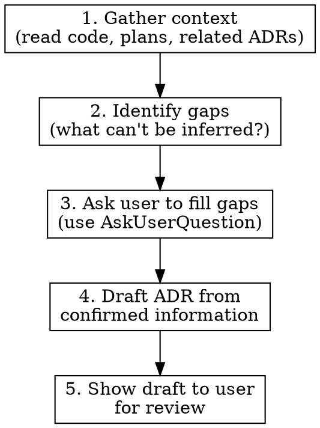

# Architecture Decision Records

Create ADRs to document significant architectural decisions with their context, options, and consequences.

## When to Use

**Explicit triggers:** User says "adr", "create an ADR", "document this decision"

**Proactive triggers** - suggest an ADR when:
- Completing work from a `docs/plans/*.md` design plan
- Choosing between competing technologies or libraries
- Changing integration patterns, data models, or API contracts
- Making decisions that constrain future choices

**Skip when:**
- Decision is trivially reversible (formatting, variable naming)
- Change is purely additive with no trade-offs
- User declines after suggestion

## Clarification-First Workflow

**ADRs document human decisions, not code.** Code shows WHAT was built; ADRs capture WHY it was chosen and what was rejected. You cannot infer rationale, trade-offs, or team context from code alone.



### Step 1: Gather context from the codebase

Read relevant code, design plans, and existing ADRs. This gives you facts about WHAT exists, not WHY it was chosen.

### Step 2: Identify what you cannot infer

For each ADR section, classify information as **known** or **must-ask**:

| Can be inferred from code/plans | Must be asked |
|--------------------------------|---------------|
| What technology/pattern is used | Why it was chosen over alternatives |
| Current implementation details | What alternatives were considered |
| File locations, package names | Constraints that drove the decision |
| Related plans/PRs that exist | Consequences the team anticipates |
| Next ADR number, date | Decision status (proposed/accepted) |
| | Team-specific context or history |

### Step 3: Ask before writing

Use `AskUserQuestion` for structured choices, or ask free-form questions for open-ended context. Combine related questions to minimize back-and-forth.

**Always ask about:**
- **Alternatives considered** — "What other options did you evaluate?"
- **Decision rationale** — "Why did you choose X over the alternatives?"
- **Status** — "Is this proposed or already accepted?"

**Ask when unclear:**
- Constraints or forces that drove the decision
- Known negative consequences the team accepts
- Risks the team has identified
- Related decisions, PRs, or issues to reference

**Example question patterns:**

Single-choice: "What's the primary reason for choosing X?"
- Performance requirements
- Team familiarity
- Integration with existing stack
- Cost/licensing

Multiple-choice: "Which alternatives did you consider?"
- Option A
- Option B
- Option C

Free-form: "What negative consequences or trade-offs does the team accept with this choice?"

### Step 4: Draft from confirmed information only

Write the ADR using only:
- Facts observed in the codebase (for Context section background)
- Information the user explicitly confirmed (for Decision, Consequences)

**Never:**
- Guess why a decision was made
- Invent alternatives that "might have been considered"
- Fabricate consequences or risks the user didn't mention
- Write the ADR anyway with "(inferred)" markers if the user hasn't answered
- Fill in blanks with "reasonable defaults"

### Step 5: Show draft for review

Present the complete ADR to the user before writing the file. The user may want to adjust wording, add context, or correct misunderstandings.

## File Convention

**Location:** `docs/adr/records/NNNN-slug.md`

**Numbering:** Scan existing files in `docs/adr/records/` to find the highest `NNNN` prefix. Increment by 1. Start at `0001` if none exist. Zero-pad to 4 digits.

**Slug:** Lowercase, hyphenated summary of the decision. Verb-first when possible.
- `0001-use-nuxt-i18n-for-multi-market.md`
- `0002-adopt-pinia-colada-for-data-fetching.md`

## Template

Use this exact structure. Every section is required unless marked optional.

```markdown
# NNNN. Decision Title

**Date:** YYYY-MM-DD
**Status:** proposed | accepted | rejected | deprecated | superseded by [NNNN]

## Context

What problem or need motivates this decision? Include relevant constraints,
requirements, and forces at play. Link to design plans if applicable:
- Related plan: `docs/plans/YYYY-MM-DD-plan-name.md`

## Decision

State the decision clearly: "We will use [X] because [Y]."

Include key implementation details only if they affect the decision's rationale
(not a full design doc).

## Consequences

### Positive
- What becomes easier or better

### Negative
- What becomes harder or worse
- Known limitations accepted

### Risks
- What could go wrong
- Mitigation strategies if applicable

## References (optional)

- Links to external docs, RFCs, PRs, issues, or related ADRs
```

## Section Guidance

| Section | Purpose | Common Mistake |
|---------|---------|----------------|
| Context | WHY we need a decision | Writing the solution here instead of the problem |
| Decision | WHAT we chose and WHY | Restating context instead of the specific choice |
| Consequences | WHAT changes because of this | Only listing positives; skipping risks |
| References | WHERE to find more | Omitting links to related plans or PRs |

## Red Flags — STOP and Ask the User

If you catch yourself doing any of these, stop and ask instead:

- Writing "we chose X because Y" when the user never stated Y
- Listing alternatives you assume were considered
- Writing consequences based on general knowledge rather than team input
- Using phrases like "likely", "presumably", "probably" in the Decision section
- Filling in a section because "it's obvious from the code"
- Creating the ADR file without showing the draft first

**All of these mean: you're guessing. Ask the user.**

## Common Mistakes

- **Missing date:** Every ADR needs a date. Use the date the decision was made, not the date the file was created.
- **Consequences only positive:** Be honest about trade-offs. Negative consequences and risks are the most valuable part for future readers.
- **Too much implementation detail:** The Decision section captures the choice and rationale, not the full design. Link to plans for details.
- **Guessing rationale from code:** Code tells you WHAT. Only the humans who made the decision can tell you WHY.
