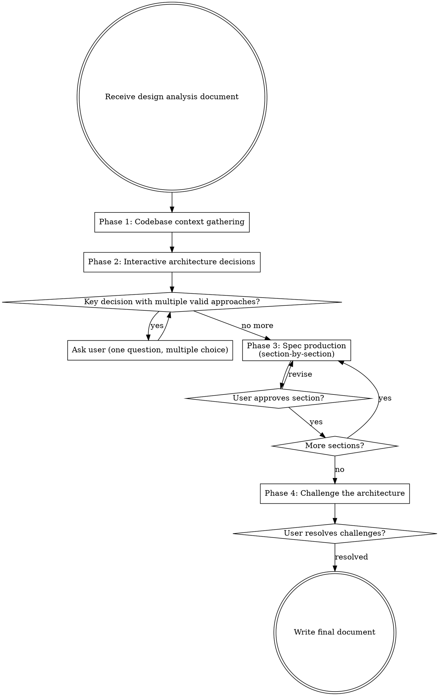
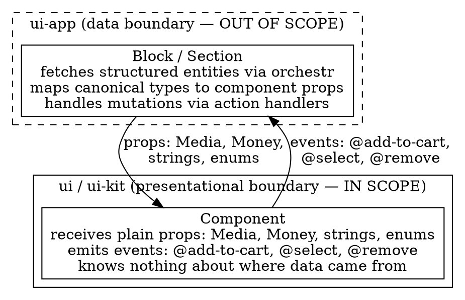
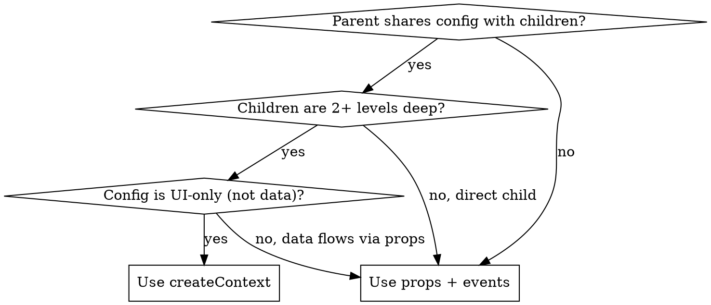

# Component Architecture

## Overview

Produce detailed component API specs from a `figma-design-analysis` plan. Takes structural input (hierarchy, tokens, variant matrix, existing matches, implementation order) and outputs the architectural decisions — props, slots, events, internal state, composition patterns — so that `figma-to-component` can implement without making design choices.

**Pipeline position:** `figma-design-analysis` -> **component-architecture** -> `figma-to-component`

**Scope boundary:** Design system components only (`ui-kit` and `ui`). Every component is a self-contained, composable primitive. Components receive all data via props, emit events for user interactions, and manage only internal UI state. No data fetching, no store access, no external system connections.

## When to Use

- After `figma-design-analysis` produces a plan with 3+ components
- When the analysis plan includes NEW or REUSE components that need API design
- Before executing with `figma-to-component` or `superpowers:executing-plans`

**Skip when:** The analysis contains only trivial single-component designs — `figma-to-component` handles lightweight architecture inline.

## Process Flowchart



## Phase Priority

Not all phases carry equal weight. If the user asks to compress the process:

| Phase | Priority | Can compress? | Minimum requirement |
|---|---|---|---|
| Phase 1: Codebase context | **Critical** | No | Must read every EXISTS/REUSE component's props, events, slots |
| Phase 2: Architecture decisions | **Critical** | Reduce to 0-1 questions | 0 when all components are pure presentational; at least 1 when compound/state decisions exist (see Question Budget) |
| Phase 3: Spec production | **Critical** | Merge into fewer groups | Can present as 2 groups instead of per-phase, but must get approval per group |
| Phase 4: Challenge | Refinement | Append non-blocking | Can append as "Open Questions for Review" in the output document |

**MUST NOT** produce specs without completing Phase 1. Specs without codebase grounding will contradict existing component APIs, creating rework during implementation.

### Handling "Just give me the specs"

If the user asks to skip the interactive process, do NOT silently comply. Instead:

1. Run Phase 1 silently (no user interaction needed anyway)
2. Compress Phase 2 to exactly 1 question — the highest-risk composition or state ownership decision
3. Present Phase 3 in 2 groups instead of per-phase
4. Append Phase 4 challenges as "Open Questions for Review" in the output

Explain briefly: *"I'll compress this, but I need to read existing components first and ask one architecture question — getting these wrong means the specs won't match the codebase."*

## Core Constraints

### Design system components only

Components are self-contained, composable design system primitives. They:
- Receive all data via props
- Emit events for user interactions
- Manage only internal UI state (open/close, selected index, animation flags, hover states). States that depend on external async operations (loading, success, error from mutations or fetches) are not internal — they must be received as props from the parent that owns the operation.
- Never fetch data, access stores, or connect to external systems

#### Why this separation matters

Components in `ui-kit` and `ui` **must not** integrate into the section/block mechanism (`defineSection`/`defineBlock` from `ui-app`). Three reasons:

1. **Reusability.** Sections/blocks cannot be rendered without a harness. A component that is a section can only be used inside the section rendering pipeline — it cannot be composed by other developers building custom components on top of existing ones.

2. **Data model decoupling.** The `ui-app` layer receives data as structured entities adhering to `@laioutr-core/canonical-types`. These types are specific to external data sources and may change. Components must not be coupled to canonical entity shapes — their props describe how the component *works and behaves*, not what data model it consumes.

3. **Two-part thinking.** This architecture enforces a clean mental model:
   - `ui-kit` / `ui` = purely presentational. Props describe component behavior. Can be reused in many contexts.
   - `orchestr` / `frontend-core` / `ui-app` = data layer. Structured entities are mapped to component props. Loose coupling between data models and rendering.

   Mixing data operations into components means every change to the data layer (new API, different store, different platform) requires editing component files, even if the UI hasn't changed.

#### Data flow



This mapping layer is out of scope for component architecture specs. When a component needs data, spec the props it accepts — the ui-app wrapper decides how to provide them.

### No page or layout patterns

Skip page-level components that orchestrate data flow, manage route state, or register as sections/blocks. Note them as belonging in ui-app and move on. The test is behavioral, not nominal: if the component could be rendered in Storybook with static props and no data layer, it is presentational — even if its name contains "Layout" or "Page." A responsive two-slot container (e.g., `form` + `summary` columns) is a presentational layout component and should be specced.

### Forbidden dependencies

Components in `ui-kit` and `ui` **must never** depend on `frontend-core`, `orchestr`, or any `@laioutr-app/*` package. These packages are data/routing layer concerns. Any import from them in a component file is an architectural violation — it couples the presentational layer to platform internals.

This rule extends beyond direct imports. Accessing state that originates from these packages through Nuxt/Vue globals (`useNuxtApp()`, `useRoute()`, `useRouter()`, `useRuntimeConfig()`) is equally forbidden — these are indirect dependencies on the data/routing layer. If a component needs route-aware behavior (e.g., active link highlighting), accept it as a prop (`active`, `isActive`) and let the ui-app wrapper determine the value.

**Theme-provided vs prop-provided resources:** Some visual assets (background images, decorative icons, placeholders, empty state illustrations) come from the theme system via `useTheme().image()` rather than from props. The test: does every instance of this component show the same asset (per theme), or does each usage show different data? If the asset varies by theme but not by usage, it belongs in the theme system and is an implementation detail — do not spec a prop for it. If the asset varies per usage (e.g., each product has its own image), it's a `Media` prop. When the analysis is ambiguous (e.g., "accept a Media prop or icon name"), check whether an existing component with similar theme-dependent visuals uses props or `useTheme()`, and flag the ambiguity in Phase 2 if unresolved.

If Phase 1 codebase gathering reveals existing components that violate this rule, do not treat them as precedent — flag them as known violations and follow the rule for new specs.

### Shared types from core-types

Use value-object types from `@laioutr-core/core-types/common` in prop interfaces where they describe presentation concerns:

| Type | Use for |
|---|---|
| `Media` | Images, videos — discriminated union with `type: 'image' \| 'video'` |
| `Money` | Monetary values — `{ amount: number; currency: string }` |
| `Swatch` | Visual representation of a product option (color, gradient, image) |
| `UnitPrice` | Price per unit — `{ price: Money; quantity: Measurement; reference: Measurement }` |
| `Measurement` | Physical measurements (weight, volume, length) |
| `Timespan` | Duration ranges (e.g. delivery estimates) |

All imported from `@laioutr-core/core-types/common`.

**Formatting helpers:** When rendering `Money` or `Measurement` values, use the `$money()` and `$measurement()` helpers available via `#imports` (Nuxt auto-imports). These provide locale-aware formatting — e.g., `$money({ amount: 1099, currency: 'EUR' })` → `"10,99 €"`. Never format these values manually with `toFixed()` or string concatenation. Note this in the spec when a component accepts `Money` or `Measurement` props: *"renders via `$money()`/`$measurement()` for localized formatting."*

**Formatting helper completeness check:** When speccing components that render value types, verify that a formatting helper exists for each type used. If a component accepts `Timespan` but no `$timespan()` helper exists yet, flag the missing helper as a prerequisite in the spec document. Do not assume helpers exist for all value types — `$money()` and `$measurement()` exist, but others may not. Search for `export function $` or `provide.*\$` in the codebase to discover available helpers.

**Why these are allowed but canonical entities are not:** These are *value objects* — small, self-contained types that describe how something looks or costs. They carry no identity, no lifecycle, and no relationships to other entities. Canonical entity types from `@laioutr-core/canonical-types` (e.g., `ProductVariant`, `Product`, `Cart`) are data-model types with identity, components, and links managed by orchestr. Components must never accept entity types as props — the ui-app mapping layer decomposes entities into value objects and primitives.

**Do NOT use `Link`** from core-types — not even as a type-only import. Although `Link` lives in core-types, it cannot be rendered as an `<a>` tag without resolution (e.g., `LinkReference` contains `{ type: 'Product', slug: 'blue-shoe' }`, not a URL). Accepting it as a prop couples the component's API to the platform's routing model. Resolution happens once at the ui-app boundary, and resolved strings flow down.

**When components need link-behavior differentiation** (e.g., `target="_blank"` for external links, smooth scroll for anchors): decompose the needed attributes into flat props or use a slot.

| Need | Solution |
|---|---|
| Simple navigation | `href: string` prop |
| External links with new tab | `href: string` + `target?: '_blank'` as separate props |
| Full link rendering control | Scoped slot: `#link="{ defaultHref }"` lets parent render `<NuxtLink>` or `<a>` with any attributes |

### Component reusability classification

Every component in the spec must be classified as either **reusable** or **sub-component**. This affects API design, context usage, and export strategy.

| | Reusable | Sub-component |
|---|---|---|
| **Definition** | Self-contained, usable in different contexts | Only meaningful within its parent component |
| **Examples** | ProductTile, Button, Card, Accordion | ProductListItem, AccordionItem, ColorSwatchGroup |
| **Props** | Fully self-contained — all data via props, no parent assumptions | May rely on parent context for shared config (size, orientation, selection state) |
| **createContext** | Never consumes parent context (it IS a potential root) | May consume parent context via `inject*Context()` |
| **Naming** | Standalone name (e.g., `ProductTile`) | `<Parent><Part>` (e.g., `AccordionItem`, `ProductListItem`) |
| **Directory** | Own directory: `components/<Name>/` | Inside parent directory: `components/<Parent>/<ParentPart>.vue` |
| **Export** | Independently importable | Only used through parent — not independently useful |

**How to classify:** If removing the component from its parent's context and placing it in a completely different page/section still makes sense, it's **reusable**. If it would be meaningless or broken without its parent, it's a **sub-component**. Classification drives naming, not the other way around — apply the removal test first, then name accordingly. If a component is named `OrderSummaryTopAccordion` but passes the removal test, it's reusable and should be renamed.

**Composition-only wrappers:** Components that group other components without adding behavior, state, or visual treatment (e.g., a `DeliveryGroup` that just composes `DeliveryEstimate` + `ProductItemList`). These exist for data-flow convenience, not for UI reasons. Classify based on the removal test: if the grouping makes sense in other contexts (order confirmation, tracking page), it's reusable. If it only makes sense within one specific parent, it's a sub-component.

**Structural sub-components vs reusable content:** A compound component pattern often has a structural sub-component (e.g., `AccordionItem`) that renders reusable content via a slot (e.g., `LoyaltyRedemption`). These are two separate components at different classification levels — don't conflate them. The `AccordionItem` is a sub-component of `Accordion`; the `LoyaltyRedemption` rendered inside it may be independently reusable. When you encounter this pattern, decompose into the structural wrapper (sub-component) and the content it renders (classify independently).

**Gray areas:** Some components start as sub-components and evolve into reusable ones (e.g., a `CartItem` designed for `CartSheet` but later used in `OrderSummary`). When unsure, classify as **reusable** — it enforces a more self-contained API, which is easier to relax later than to tighten.

**When the analysis disagrees with the removal test:** If the analysis document explicitly classifies a component (e.g., "private sub-component") but the removal test suggests otherwise, flag the disagreement in Phase 4 (composability check) and let the user decide. The analysis classification may be intentional (keeping scope narrow for v1) or may be an oversight.

**In the spec:** Annotate each component with `(reusable)` or `(sub-component of <Parent>)` next to its name. This classification feeds into the composability check (Phase 4) — sub-components are allowed to be tightly coupled to their parent, but reusable components must not be.

### Two state-sharing patterns only

| Pattern | When | Example |
|---|---|---|
| **Props + events** | Default. Single-level composition, event-driven coordination. | CartSheet -> CartListItem (props down, events up) |
| **createContext (reka-ui)** | Compound components where parent shares UI config with deep children. Never for passing data. | Field -> Input (shares id, error, required, disabled), Accordion -> AccordionItem (shares size) |

No raw provide/inject. No dedicated context files outside the component directory. No Pinia stores within components.

#### reka-ui compound delegation

When a component wraps a reka-ui compound primitive (e.g., `RadioGroupRoot`/`RadioGroupItem`, `AccordionRoot`/`AccordionItem`), check whether reka-ui's own internal context provides the shared state children need. If yes, no custom `createContext` is needed — the component is compound by delegation. Only add a custom context layer when sharing UI config that reka-ui does not cover (e.g., `Accordion` adds `size` because reka-ui's accordion context doesn't track sizing).

#### Controlled reka-ui components

When the parent must control a reka-ui primitive's state (e.g., which accordion item is open in a step-based flow), use reka-ui's `modelValue`/`v-model` prop to make it controlled. This is standard props+events, not a separate pattern. Document in the spec: *"wraps reka-ui [primitive] in controlled mode — parent drives [state] via props."* Common for step flows (express checkout), single-select tabs, and any case where the parent owns progression logic.

#### Render-wrapping with reka-ui structural primitives

A container may wrap reusable children in reka-ui structural elements to add coordination without modifying the child's API. For example, `OrderSummaryTabs` wraps each child in a reka-ui `AccordionItem` to give accordion behavior — the children (e.g., `LoyaltyRedemption`) don't know they're inside an accordion and remain independently usable. This is a composition strategy, not a third state-sharing pattern. Document as: *"default slot with structural wrapping — each child wrapped in [reka-ui element] for [behavior]."*

#### createContext convention

```typescript
// In parent's <script lang="ts"> block (non-setup, for export)
import { createContext } from 'reka-ui';
export const [injectFieldContext, provideFieldContext] = createContext<{
  id?: Ref<string>;
  error?: Ref<string | undefined>;
  required?: Ref<boolean>;
  disabled?: Ref<boolean>;
}>('Field');
```

Naming: `inject*Context` / `provide*Context`. Parent calls `provide*Context({...})`, children call `inject*Context()`. Context values are `Ref<T>` or `ComputedRef<T>` for reactivity.

#### When to use createContext vs props



## Phase 1: Codebase Context Gathering

Read existing components referenced in the analysis document to ground the architecture in what already exists.

**For each component marked EXISTS or REUSE in the analysis:**
1. Read the `.vue` file — extract props interface, defineEmits, defineSlots, defineModel usage
2. Read `*Context.ts` if present — understand what's shared via createContext
3. Note the component's composition pattern (direct imports, slots, dynamic components)

**For components planned in another analysis (not yet implemented):**
1. Read the referenced analysis document to understand the component's behavior, variant matrix, and hierarchy
2. If a component architecture spec already exists for the referenced analysis, read the planned props/events/slots from that spec — treat as authoritative, do not re-spec
3. If no architecture spec exists, note the component's behavioral description and constraints. During Phase 3, spec props based on what *this* design needs and mark as `(assumed — pending architecture spec from [reference])`. Flag any naming discrepancies between analysis documents.
4. Verify component names match between analysis documents. If the thank-you analysis calls it "DeliveryEstimate" but the checkout analysis calls it "DeliveryEstimateBanner," flag the discrepancy to the user.

**Considered but rejected components:** If the analysis includes a "Considered but rejected" section, accept the rejections — do not re-read those components in Phase 1. If Phase 4's over-engineering check reveals that a new component is structurally similar to a rejected one, flag the overlap and ask the user whether to extend the existing component instead.

**Cross-plan shared components:** When the analysis claims a component is shared across plans (e.g., "InfoBox is also used by checkout plan's LoyaltyPointsRedemption"), verify the claim by reading the referenced analysis. If the other analysis does not mention the shared component by name, flag the discrepancy. If it does, ensure the component is specced once (in whichever architecture spec comes first) and referenced by the other. Note the shared dependency in the Integration Requirements section.

**Search for semantically similar components:** Don't limit Phase 1 searches to components explicitly named in the analysis. Search for components with similar *semantic roles* — if the design has discount badges, search for "discount", "flag", "badge" across ui-kit/ui. If it has status indicators, search for "status", "notice", "alert". The analysis may reference `ComponentA` when a better-fitting `ComponentB` exists that the analysis author didn't know about. Discovering these in Phase 1 prevents speccing new components that duplicate existing ones or using the wrong existing component.

**Search for patterns:**
```bash
# Find all createContext usages to understand compound component conventions
grep -r "createContext" packages/ui-kit/src/runtime/app/components/ --include="*.vue" --include="*.ts"

# Find defineModel usage for v-model patterns
grep -r "defineModel" packages/ui-kit/src/runtime/app/components/ --include="*.vue"

# Search for semantically similar components (adapt keywords to the design)
# e.g., for a checkout design with discount badges:
grep -r "discount\|flag\|badge" packages/ui-kit/src/runtime/app/components/ --include="*.vue" -l
```

**Result:** A mental model of existing API patterns that constrains the new specs to be consistent.

## Phase 2: Interactive Architecture Decisions

For key decisions where multiple valid approaches exist, ask the user **one question at a time** using `AskUserQuestion` (2-4 options, multiple choice preferred).

### When to ask

Only ask when the choice materially affects the architecture:
- **Composition pattern**: Direct imports vs scoped slots vs dynamic components
- **State ownership**: Internal state vs parent-controlled via props+events
- **Context sharing**: createContext vs prop drilling for compound components
- **Component boundary**: Merge two related components vs keep separate

### Question budget

- **Minimum:** 1 question when the design includes compound components, non-obvious state ownership, or ambiguous composition patterns. **0 questions when all components are pure presentational with standard patterns.** In the zero case, briefly state why: *"All components are straightforward presentational compositions — no compound patterns or state ownership ambiguities. Proceeding to spec production."*
- **Maximum:** 3 questions (for designs with 5+ complex components)
- If more than 3 decisions are ambiguous, batch related decisions into a single question with a brief preamble explaining the trade-off pattern, then ask which approach to apply broadly.
- **Prioritization:** When more decisions are ambiguous than the budget allows, prioritize by **blast radius** — decisions that affect more downstream components come first. Eliminate decisions that have clear codebase precedent (Phase 1 findings) or are already answered by the analysis document.

### When NOT to ask

- Trivial components (pure presentational, props-to-template)
- Decisions already answered in the analysis document
- Standard patterns with clear codebase precedent

### Example questions

- "ComponentA renders inline forms when expanded. Should it import form components directly, accept them via scoped slots, or use dynamic components?"
- "The loyalty points interaction has 3 states (idle -> input -> applied). Should this be internal state in OrderSummary, or parent-controlled via props + events?"
- "ComponentB shares collapsed/expanded state with a sibling trigger. Should this use createContext (they share a common parent) or a v-model prop on the parent?"

## Phase 3: Spec Production

Produce specs for all components (excluding page-level), organized by the implementation order from the analysis document. Present specs **section-by-section** (grouped by implementation phase) for user validation.

### Introducing components not in the analysis

The analysis document from `figma-design-analysis` captures what's visible in Figma. Architecture sometimes requires components that aren't in any design — data-grouping wrappers, intermediate composition layers, or structural abstractions that emerge from data flow analysis.

**When to introduce:** During Phase 3, if the prop boundary check reveals that two or more sibling components always receive the same scoped data (e.g., `DeliveryEstimate` and `ProductItemList` both need data for a single delivery group), introduce a composition wrapper to mediate the data flow. Also introduce components when the user proposes them during Phase 2/3 review.

**How to document:** Mark introduced components with `(introduced — not in analysis)` in the spec. Include a one-sentence justification explaining why the component is architecturally necessary. Classify as reusable or sub-component using the standard removal test.

### Trivial component spec (one-liner)

For pure presentational components with no internal state, no events beyond click, no slots, and whose prop interface is self-explanatory from types alone:

```markdown
**PriceDisplay** _(reusable)_ — Renders formatted price with optional strikethrough for original price.
Props: `{ price: Money; originalPrice?: Money; size?: 's' | 'm' | 'l' }`
```

### Complex component spec (full)

For components with internal state, slots, events, or compound composition:

```markdown
### ComponentName _(reusable)_ or _(sub-component of ParentName)_

**Purpose:** One sentence describing what this component does.

**Props:**
\```typescript
interface ComponentNameProps {
  // Data props — the component's data contract
  items: ItemType[];
  selectedId?: string;

  // UI configuration props
  size?: 's' | 'm' | 'l';
  variant?: 'default' | 'compact';

  // v-model props (Vue 3.4+ defineModel)
  // modelValue is implicit via defineModel
}
\```

**Slots:**
| Name | Scoped Data | Purpose |
|---|---|---|
| `default` | — | Main content area |
| `item` | `{ item: ItemType; index: number; isSelected: boolean }` | Custom rendering per item |
| `empty` | — | Shown when items array is empty |

**Events:**
| Event | Payload | When |
|---|---|---|
| `select` | `[id: string]` | User selects an item |
| `remove` | `[id: string]` | User clicks remove on an item |

**Internal State:** _(mutable state only — values that change in response to user interaction)_
- `expandedId: Ref<string | null>` — tracks which item is expanded (UI-only)
- `isAnimating: Ref<boolean>` — prevents interaction during transition
- _(Computed/derived values from props, like overflow counts or formatted labels, are implementation details — don't list them here.)_

**Context Sharing:** _(only if compound component)_
- Provides: `{ size: ComputedRef<'s' | 'm' | 'l'>; expandedId: Ref<string | null> }` via createContext
- Children consume via `injectComponentNameContext()`

**Composition:**
- Imports `ChildA`, `ChildB` directly
- `item` slot allows parent to override default item rendering
- Uses reka-ui `AccordionRoot` for keyboard navigation
- Default slot with structural wrapping — each child wrapped in reka-ui `AccordionItem` for coordination _(when applicable)_
```

### Parent-owned state as props

States that depend on operations or decisions owned by the parent (async mutations, form validation timing, submission attempts) are not internal — they must be received as props. The test: does the component itself decide *when* to show this state? If the parent triggers or controls when the state appears, it's a prop.

**Async operation status:** For components that trigger async operations via events (e.g., add-to-cart, form submit), accept a `status` prop from the parent. The parent owns the mutation and controls the status. The component may use internal state for timed visual transitions (e.g., reverting a success indicator after a delay).

```typescript
status?: 'idle' | 'loading' | 'success' | 'error';
```

**Validation errors** are almost always props because the parent controls when validation runs (on form submit, on blur, on field change). A `ShippingMethodSelector` knows whether nothing is selected, but the parent decides when to show the error — the component receives `error?: string` as a prop.

### Prefer unions over boolean flags

When a prop has mutually exclusive states, use a discriminated or literal union instead of separate boolean flags. Unions make invalid states unrepresentable and produce cleaner APIs.

```typescript
// ❌ BAD: boolean flag + separate value
value: Money;
isFree: boolean;  // if true, value is ignored — confusing

// ✅ GOOD: literal union
value: Money | 'free';

// ❌ BAD: flat flags for grouped metadata
icon?: string;
code?: string;
badgeText?: string;

// ✅ GOOD: composed type
badge?: { icon?: string; text: string };
```

Apply the same principle to event payloads and slot scoped data. If two fields are always used together, group them. If a boolean exists only to disable/ignore another prop, merge them into a union.

### State transitions for multi-state components

When a component's state prop has 3+ values with non-obvious transitions, document valid transitions in the spec. Include which event triggers each transition and which transitions are invalid. Without this, the implementer and the ui-app wrapper author may disagree on valid transitions.

```markdown
**State Transitions:**
`closed` --(@toggle)--> `open` --(@redeem)--> `redeemed` --(@undo)--> `open`
Invalid: `closed` -> `redeemed` (must open first)
```

Binary toggles (open/closed) don't need this — the transitions are obvious.

### Static text vs data props (i18n boundary)

Static user-facing text (headings like "Thank you for your order!", section titles like "Order summary", button labels like "Continue shopping") is an i18n implementation detail — it lives inside the component as a locale key (`$t('thankYou.heading')`), NOT as a prop. Do not spec `heading?: string` for text that is the same across all usages.

Dynamic data embedded in user-facing text (order numbers, names, counts, dates) should be individual props. The text template containing the dynamic data is handled by i18n interpolation inside the component (`$t('thankYou.subline', { orderNumber })`).

| Text type | Spec as | Example |
|---|---|---|
| Fully static | Not a prop — i18n key inside component | "Order summary" heading |
| Static with dynamic data | Individual props for each dynamic value | `orderNumber: string` (template: "Order #{orderNumber}") |
| Fully dynamic (varies per usage) | `string` prop | `title: string` on a generic card |

When unsure, check Phase 1 findings for how existing components handle similar text. If a component has a mandatory `title` prop that callers always set to the same i18n string, it should probably be internal.

### List item types

When a parent component renders a list of children, the item type should be the child component's props interface (or a subset via `Pick<>`), not a domain entity type. If the item shape starts resembling a canonical entity rather than a component contract, that is a sign the mapping responsibility has leaked from ui-app into the component.

**When the child component's interface is unknown (cross-plan dependency):** If the child is planned in another analysis with no architecture spec yet, prefer a **slot** over an array prop. A slot defers the interface decision to the parent (ui-app wrapper), which will know the child's final props. Mark the slot with a note: *"slot defers to parent because [ChildComponent] props are not yet specced — switch to array prop once [reference] architecture is complete."* If the parent needs to control layout around the list items (e.g., gap, separator), spec the slot with structural wrapping guidance. Only use a guessed array prop if the child's behavioral description in the referenced analysis makes the props obvious and stable.

**Reuse child props types for composition:** When a parent composes a child 1:1 (e.g., `DeliveryGroup` contains one `DeliveryEstimate`), accept the child's props interface as a single prop rather than duplicating its fields. This keeps the parent's API in sync with the child and avoids field drift.

```typescript
// ❌ BAD: duplicating child fields
interface DeliveryGroupProps {
  title: string;
  estimatedDelivery: Timespan;  // duplicated from DeliveryEstimate
  providerLogo?: Media;         // duplicated from DeliveryEstimate
  items: CheckoutProductItemProps[];
}

// ✅ GOOD: reference child's props type
interface DeliveryGroupProps {
  title: string;
  deliveryEstimate: DeliveryEstimateProps;
  items: CheckoutProductItemProps[];
}
```

This also applies to list items: `items: ChildComponentProps[]` is better than defining an inline type that mirrors the child's interface. The exception is when the parent uses only a subset — use `Pick<ChildProps, ...>[]` to narrow.

**Interface narrowing for reduced-mode usage:** When a parent uses a child in a reduced mode (e.g., only 1 of 9 line item types, read-only without interactive controls), spec the parent's props to match only its actual usage — not the child's full interface. Note the child's broader capability for future extension. This prevents the parent's API from exposing unused complexity.

### Vue API conventions (from figma-to-component)

| API | Usage |
|---|---|
| `defineProps<T>()` + `withDefaults()` | All props with defaults |
| `defineEmits<{ event: [payload] }>()` | Vue 3.3+ tuple syntax, never legacy call-signature |
| `defineModel<T>('name')` | Two-way `v-model` binding (Vue 3.4+) |
| `defineSlots<{ name(props: T): any }>()` | Typed slot declarations |
| `createContext` from reka-ui | Compound component state sharing |

### Presentation order

Group specs by implementation phase from the analysis document. After presenting each group, **stop and wait for explicit approval** before presenting the next group — do not interpret "looks good" on a previous group as blanket approval for all remaining groups. Ask: *"Does this group look right, or should I adjust anything before moving on?"*

## Phase 4: Challenge the Architecture

Before writing the final document, run these checks and present findings as numbered questions:

1. **Consistency check**: Are similar component relationships using different patterns? (e.g., one parent uses createContext while a similar parent uses plain props for the same kind of relationship)

2. **Over-engineering check**: Are there components with createContext that could work with simple props? createContext is only justified for 2+ levels of nesting with UI-only config.

3. **Under-specification check**: Are there components with internal state or events that only got a trivial spec? If a component manages state, it needs a full spec.

4. **Prop boundary check**: Is every component's data fully receivable via props? If a component seems to need data not passed from its parent, the hierarchy or props interface is incomplete. When the incomplete boundary is because the coordinator is a page-level component (out of scope), document the dependency as an integration requirement — do not resolve it by speccing the page component. Format: `[Consumer] needs [data] from [source], mediated by [page/section wrapper]`.

5. **Composability check**: For each component classified as **reusable** — can it be used independently outside this design's specific context? If it's tightly coupled to a sibling or parent, either reclassify it as a sub-component or restructure. For each **sub-component** — is the coupling to its parent justified? Three possible resolutions:
   - **Keep as sub-component** — coupling is inherent (e.g., AccordionItem needs Accordion's open/close coordination)
   - **Promote to reusable** — the component works independently with minor API changes
   - **Decompose** — the sub-component wraps reusable content (e.g., an AccordionItem rendering a LoyaltyRedemption form). Split into the structural wrapper (stays sub-component) and the content it renders (classify independently as reusable if it passes the removal test)

Present challenges as numbered questions. Wait for answers before finalizing.

**If all 5 checks pass:** Still present a summary to the user: *"I ran consistency, over-engineering, under-specification, prop boundary, and composability checks. No issues found. Shall I proceed to write the final document, or do you want to challenge any specific component?"* **MUST NOT** skip presenting check results, even when clean — the user's confirmation is the gate to the final document.

## Output Format

Write to `docs/plans/YYYY-MM-DD-<topic>-component-architecture.md`.

### Template

```markdown
# Component Architecture: [Topic]

Analysis source: [path to design analysis document]
Date: [date]

## Conventions

- Props + events for single-level composition (default)
- createContext (reka-ui) for compound components sharing UI config with deep children
- All data via props. No data fetching, no store access.
- Internal state is UI-only: open/close, selected index, animation flags

## Architecture Decisions

| # | Decision | Choice | Rationale |
|---|---|---|---|
| 1 | [question from Phase 2] | [chosen approach] | [why] |
| ... | ... | ... | ... |

## Component Specs

### Phase 1: [leaf components]

#### ComponentA
[trivial or full spec]

#### ComponentB
[trivial or full spec]

### Phase 2: [compositions]

#### ComponentC
[full spec — composes Phase 1 components]

### Phase 3: [top-level organisms]

#### ComponentD
[full spec — composes Phase 2 components]

## Resolved Challenges

| # | Challenge | Resolution |
|---|---|---|
| 1 | [from Phase 4] | [user's answer] |

## Integration Requirements (deferred to ui-app)

- [Consumer] needs [data] from [source], mediated by [page/section wrapper]
- [If no cross-organism data dependencies: omit this section]

## Open Questions

- [Unresolved items, if any]
```

## What This Skill Does NOT Do

- Produce implementation code (that's `figma-to-component`)
- Redo structural analysis, token mapping, or package placement (that's `figma-design-analysis`)
- Specify CSS patterns, BEM naming, or Storybook stories (implementation details)
- Plan data integration, Pinia stores, or data-fetching composables (ui-app scope)
- Plan ui-app Section/Block wrappers (out of scope)
- Spec page-level components, layouts, or Nuxt routing (out of scope)

## Common Mistakes

| Mistake | Fix |
|---|---|
| Specifying CSS/BEM patterns in the architecture | Architecture defines the API (props, slots, events). CSS is implementation. |
| Using raw provide/inject instead of createContext | Always use `createContext` from reka-ui for compound component state. |
| Using createContext for passing data | createContext is for UI config (size, expanded state, IDs). Data flows via props. |
| Components that fetch data or call APIs | Components receive all data via props. Data integration belongs in ui-app. |
| Speccing page components or layouts | Skip them, note they belong in ui-app. |
| Dumping all specs at once | Present section-by-section grouped by implementation phase. |
| Asking about trivial components | Only ask when the decision materially affects architecture. |
| Props interface missing data that the component renders | Every piece of rendered data must trace back to a prop. Flag incomplete boundaries. |
| Over-using createContext for direct parent-child | createContext is for 2+ levels of nesting. Direct children use props. |
| Skipping the challenge phase | Always run consistency, over-engineering, under-spec, boundary, and composability checks. |
| Specifying defineSection or defineBlock patterns | Section/block wrappers are ui-app concerns, out of scope. |
| Not reading existing components first | Phase 1 grounds specs in codebase reality. Skipping it leads to inconsistent APIs. |
| Using `Link` type from core-types in props | `Link` requires frontend-core for resolution. Use plain `string` hrefs or a slot for link rendering. |
| Importing from frontend-core or orchestr in ui/ui-kit | Forbidden dependency. Components must never depend on data/routing layer packages. |
| Accessing frontend-core state via Nuxt globals | `useNuxtApp()`, `useRoute()`, `useRouter()` are indirect dependencies. Locale via `useLocale()`, active state via props. |
| Treating existing rule violations as precedent | If an existing component in ui/ui-kit violates a constraint (e.g., uses `useRouter()`), do not replicate. Flag it and follow the rule for new specs. |
| Props shaped like canonical entities | Props describe component behavior, not data models. Map entity fields to behavioral props (e.g. `price: Money`, not `product: ProductEntity`). |
| List item type shaped like a domain entity | Item arrays should use the child component's props interface (`Pick<ChildProps, ...>[]`), not entity types. |
| Treating async operation state as internal | Loading/success/error from parent-owned mutations must be props, not internal state. Only timed visual transitions (animation flags) are internal. |
| Not classifying components as reusable vs sub-component | Every component must be annotated. Sub-components can assume parent context; reusable components must be fully self-contained. |
| Sub-component with a fully self-contained API | If a component is only used inside its parent, it can rely on parent context — over-specifying props duplicates what createContext already provides. |
| Reusable component that depends on parent context | If a component is independently usable, it must not require `inject*Context()` to function. All data via props. |
| Treating the analysis component set as immutable | Architecture may require components not in Figma (data-grouping wrappers, intermediate compositions). Introduce them with justification and mark `(introduced — not in analysis)`. |
| Conflating structural sub-components with their slot content | An AccordionItem (sub-component) rendering a LoyaltyRedemption form (potentially reusable) are two different components. Decompose and classify independently. |
| Classifying based on name instead of removal test | A component named `OrderSummaryTopSection` looks like a sub-component but may pass the removal test. Classification drives naming, not vice versa. |
| Skipping a component because its name contains "Layout" or "Page" | The no-page-or-layout rule is behavioral, not nominal. A responsive two-slot container is presentational even if named "Layout." |
| Adding custom createContext when reka-ui's own context is sufficient | If wrapping a reka-ui compound primitive, check whether reka-ui's internal context already provides what children need. Only add a custom layer for config reka-ui doesn't track. |
| Multi-state prop without transition documentation | If a component has 3+ state values, document which transitions are valid and which events trigger them. |
| Treating validation errors as internal state | Validation errors are parent-controlled (the parent decides when to validate). Spec as `error?: string` prop. |
| Speccing static text as a prop | Static user-facing text ("Thank you!", "Order summary") is an i18n key inside the component, not a prop. Only spec props for dynamic data (order numbers, names, counts). |
| Treating `useTheme()` as a forbidden dependency | `useTheme()` is a ui-kit-internal composable. It is NOT an external dependency. Components use it for theme images, icons, and breakpoints. |
| Speccing a prop for theme-provided resources | Decorative backgrounds, placeholders, and empty state images that come from the theme system (`useTheme().image()`) are implementation details, not props. Only spec `Media` props for instance-varying data. |
| Skipping Phase 1 for planned-but-unimplemented components | When components are "planned in another analysis," read that analysis document. Verify names match, check if an architecture spec exists, and note behavioral constraints. |
| Re-speccing a component already specced in another architecture document | Shared cross-plan components should be specced once. Reference the existing spec instead of creating a duplicate. |
| Forcing a Phase 2 question when no architecture decisions exist | If all components are pure presentational with no compound patterns or state ownership ambiguity, 0 questions is correct. Don't invent a question to meet a minimum. |
| Using array prop when child interface is unknown | When a child component is planned but not yet specced, prefer a slot to defer the interface decision. Mark the slot with a reconciliation note. |
| Exposing child's full interface through parent | When a parent uses a child in reduced mode, narrow the parent's props to actual usage — don't pass through the child's full interface for "flexibility." |
| Re-reading components the analysis explicitly rejected | Accept the analysis's "Considered but rejected" decisions. Only revisit if Phase 4 over-engineering check finds structural overlap with a new component. |
| Using boolean flag to disable/ignore another prop | Use a literal union instead: `value: Money \| 'free'` not `value: Money` + `isFree: boolean`. Unions make invalid states unrepresentable. |
| Duplicating child fields in parent props | When a parent composes a child 1:1, accept the child's props type as a single prop (`deliveryEstimate: DeliveryEstimateProps`) instead of flattening its fields. |
| Only searching for components named in the analysis | Phase 1 should also search for semantically similar components (e.g., "discount", "badge", "flag") — the analysis may reference the wrong existing component or miss a better fit. |
| Assuming formatting helpers exist for all value types | Only `$money()` and `$measurement()` are confirmed. Check whether helpers exist for other value types (`Timespan`, etc.) and flag missing ones as prerequisites. |
