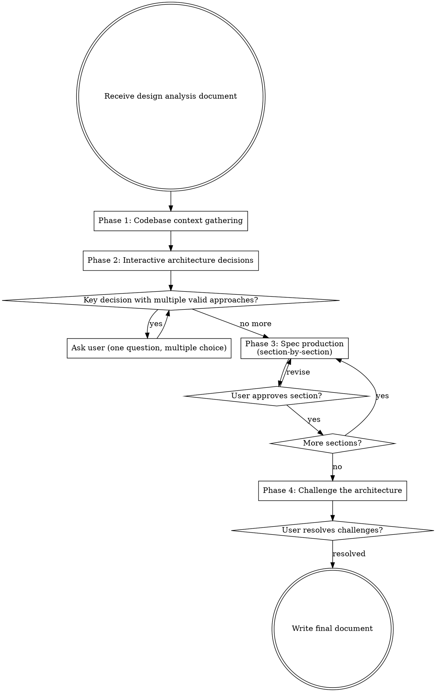

# Figma Component Architecture

## Overview

Produce detailed component API specs from a `figma-design-analysis` plan. Takes structural input (hierarchy, tokens, variant matrix, existing matches, implementation order) and outputs the architectural decisions — props, slots, events, internal state, composition patterns — so that `figma-to-component` can implement without making design choices.

**Pipeline position:** `figma-design-analysis` -> **figma-component-architecture** -> `figma-to-component`

**Scope boundary:** Presentational components only. Every component is a self-contained, composable primitive. It receives all data via props, emits events for user interactions, and manages only internal UI state. No data fetching, no store access, no external system connections — those belong in the Section/Block wrapper (see `writing-section-block-definitions`).

## When to Use

- After `figma-design-analysis` produces a plan with 3+ components
- When the analysis plan includes NEW or REUSE components that need API design
- Before executing with `figma-to-component` or `superpowers:executing-plans`

**Skip when:** The analysis contains only trivial single-component designs — `figma-to-component` handles lightweight architecture inline.

## Process Flowchart



## Core Constraints

**Open [`references/core-constraints.md`](references/core-constraints.md)** for: the design-system-only scope, the forbidden dependencies (`frontend-core`, `orchestr`, `@laioutr-app/*`, and indirect access via `useNuxtApp()`/`useRoute()`/`useRouter()`), value-object types allowed in prop interfaces (`Media`, `Money`, `Swatch`, `UnitPrice`, `Measurement`, `Timespan`), the `Link`-from-core-types prohibition, the reusable-vs-sub-component classification (with the removal test), and the two permitted state-sharing patterns (`props + events` and `createContext` from reka-ui).

**Two high-frequency rules to keep in mind throughout:**

- **`useTheme()` is allowed; `useNuxtApp()` / `useRoute()` / `useRouter()` are forbidden.** Theme-provided assets come from `useTheme().image()`. Route-aware state (active link, current path) must be accepted as a prop — the Section/Block wrapper resolves it.
- **Classification before naming.** Apply the removal test (does this component make sense outside its parent's context?) to decide `(reusable)` vs `(sub-component of <Parent>)`. The name follows the classification, not the other way around.

## Phase Priority

Not all phases carry equal weight. If the user asks to compress the process:

| Phase | Priority | Can compress? | Minimum requirement |
|---|---|---|---|
| Phase 1: Codebase context | **Critical** | No | Must read every EXISTS/REUSE component's props, events, slots |
| Phase 2: Architecture decisions | **Critical** | Reduce to 0-1 questions | 0 when all components are pure presentational; at least 1 when compound/state decisions exist (see Question Budget) |
| Phase 3: Spec production | **Critical** | Merge into fewer groups | Can present as 2 groups instead of per-phase, but must get approval per group |
| Phase 4: Challenge | Refinement | Append non-blocking | Can append as "Open Questions for Review" in the output document |

**MUST NOT** produce specs without completing Phase 1. Specs without codebase grounding will contradict existing component APIs, creating rework during implementation.

### Handling "Just give me the specs"

If the user asks to skip the interactive process, do NOT silently comply. Instead:

1. Run Phase 1 silently (no user interaction needed anyway)
2. Compress Phase 2 to exactly 1 question — the highest-risk composition or state ownership decision
3. Present Phase 3 in 2 groups instead of per-phase
4. Append Phase 4 challenges as "Open Questions for Review" in the output

Explain briefly: *"I'll compress this, but I need to read existing components first and ask one architecture question — getting these wrong means the specs won't match the codebase."*

## Phase 1: Codebase Context Gathering

Read existing components referenced in the analysis document to ground the architecture in what already exists.

**For each component marked EXISTS or REUSE in the analysis:**
1. Read the `.vue` file — extract props interface, defineEmits, defineSlots, defineModel usage
2. Read `*Context.ts` if present — understand what's shared via createContext
3. Note the component's composition pattern (direct imports, slots, dynamic components)

**For components planned in another analysis (not yet implemented):**
1. Read the referenced analysis document to understand the component's behavior, variant matrix, and hierarchy
2. If a component architecture spec already exists for the referenced analysis, read the planned props/events/slots from that spec — treat as authoritative, do not re-spec
3. If no architecture spec exists, note the component's behavioral description and constraints. During Phase 3, spec props based on what *this* design needs and mark as `(assumed — pending architecture spec from [reference])`. Flag any naming discrepancies between analysis documents.
4. Verify component names match between analysis documents. If the thank-you analysis calls it "DeliveryEstimate" but the checkout analysis calls it "DeliveryEstimateBanner," flag the discrepancy to the user.

**Considered but rejected components:** If the analysis includes a "Considered but rejected" section, accept the rejections — do not re-read those components in Phase 1. If Phase 4's over-engineering check reveals that a new component is structurally similar to a rejected one, flag the overlap and ask the user whether to extend the existing component instead.

**Cross-plan shared components:** When the analysis claims a component is shared across plans (e.g., "InfoBox is also used by checkout plan's LoyaltyPointsRedemption"), verify the claim by reading the referenced analysis. If the other analysis does not mention the shared component by name, flag the discrepancy. If it does, ensure the component is specced once (in whichever architecture spec comes first) and referenced by the other. Note the shared dependency in the Integration Requirements section.

**Search for semantically similar components:** Don't limit Phase 1 searches to components explicitly named in the analysis. Search for components with similar *semantic roles* — if the design has discount badges, search for "discount", "flag", "badge" across upstream `@laioutr-core/ui-kit` and `@laioutr-core/ui`. If it has status indicators, search for "status", "notice", "alert". The analysis may reference `ComponentA` when a better-fitting `ComponentB` exists that the analysis author didn't know about. Discovering these in Phase 1 prevents speccing new components that duplicate existing ones or using the wrong existing component.

**Search for patterns:**
```bash
# Find all createContext usages to understand compound component conventions
grep -r "createContext" node_modules/@laioutr-core/ui-kit/src/runtime/app/components/ --include="*.vue" --include="*.ts"

# Find defineModel usage for v-model patterns
grep -r "defineModel" node_modules/@laioutr-core/ui-kit/src/runtime/app/components/ --include="*.vue"

# Search for semantically similar components (adapt keywords to the design)
# e.g., for a checkout design with discount badges:
grep -r "discount\|flag\|badge" node_modules/@laioutr-core/ui-kit/src/runtime/app/components/ --include="*.vue" -l
```

(Path layout assumes npm/yarn; pnpm users adjust to `node_modules/.pnpm/...`.)

**Result:** A mental model of existing API patterns that constrains the new specs to be consistent.

## Phase 2: Interactive Architecture Decisions

For key decisions where multiple valid approaches exist, ask the user **one question at a time** using `AskUserQuestion` (2-4 options, multiple choice preferred).

### When to ask

Only ask when the choice materially affects the architecture:
- **Composition pattern**: Direct imports vs scoped slots vs dynamic components
- **State ownership**: Internal state vs parent-controlled via props+events
- **Context sharing**: createContext vs prop drilling for compound components
- **Component boundary**: Merge two related components vs keep separate

### Question budget

- **Minimum:** 1 question when the design includes compound components, non-obvious state ownership, or ambiguous composition patterns. **0 questions when all components are pure presentational with standard patterns.** In the zero case, briefly state why: *"All components are straightforward presentational compositions — no compound patterns or state ownership ambiguities. Proceeding to spec production."*
- **Maximum:** 3 questions (for designs with 5+ complex components)
- If more than 3 decisions are ambiguous, batch related decisions into a single question with a brief preamble explaining the trade-off pattern, then ask which approach to apply broadly.
- **Prioritization:** When more decisions are ambiguous than the budget allows, prioritize by **blast radius** — decisions that affect more downstream components come first. Eliminate decisions that have clear codebase precedent (Phase 1 findings) or are already answered by the analysis document.

### When NOT to ask

- Trivial components (pure presentational, props-to-template)
- Decisions already answered in the analysis document
- Standard patterns with clear codebase precedent

### Example questions

- "ComponentA renders inline forms when expanded. Should it import form components directly, accept them via scoped slots, or use dynamic components?"
- "The loyalty points interaction has 3 states (idle -> input -> applied). Should this be internal state in OrderSummary, or parent-controlled via props + events?"
- "ComponentB shares collapsed/expanded state with a sibling trigger. Should this use createContext (they share a common parent) or a v-model prop on the parent?"

## Phase 3: Spec Production

**Open [`references/spec-format.md`](references/spec-format.md)** for: when to introduce components not in the analysis, the trivial-vs-full spec template choice, parent-owned state as props (async status, validation errors), unions over boolean flags, state transitions for multi-state components, the static-text-vs-data-props i18n boundary, list item types (including cross-plan-dependency deferral via slot), Vue API conventions, and the section-by-section presentation rule.

Produce specs for all components (excluding page-level), organized by the implementation order from the analysis document. Present specs **section-by-section** (grouped by implementation phase) for user validation. After presenting each group, wait for explicit approval before presenting the next — do not interpret "looks good" on one group as blanket approval.

## Phase 4: Challenge the Architecture

Before writing the final document, run these checks and present findings as numbered questions:

1. **Consistency check**: Are similar component relationships using different patterns? (e.g., one parent uses createContext while a similar parent uses plain props for the same kind of relationship)

2. **Over-engineering check**: Are there components with createContext that could work with simple props? createContext is only justified for 2+ levels of nesting with UI-only config.

3. **Under-specification check**: Are there components with internal state or events that only got a trivial spec? If a component manages state, it needs a full spec.

4. **Prop boundary check**: Is every component's data fully receivable via props? If a component seems to need data not passed from its parent, the hierarchy or props interface is incomplete. When the incomplete boundary is because the coordinator is a page-level component (out of scope), document the dependency as an integration requirement — do not resolve it by speccing the page component. Format: `[Consumer] needs [data] from [source], mediated by [page/section wrapper]`.

5. **Composability check**: For each component classified as **reusable** — can it be used independently outside this design's specific context? If it's tightly coupled to a sibling or parent, either reclassify it as a sub-component or restructure. For each **sub-component** — is the coupling to its parent justified? Three possible resolutions:
   - **Keep as sub-component** — coupling is inherent (e.g., AccordionItem needs Accordion's open/close coordination)
   - **Promote to reusable** — the component works independently with minor API changes
   - **Decompose** — the sub-component wraps reusable content (e.g., an AccordionItem rendering a LoyaltyRedemption form). Split into the structural wrapper (stays sub-component) and the content it renders (classify independently as reusable if it passes the removal test)

Present challenges as numbered questions. Wait for answers before finalizing.

**If all 5 checks pass:** Still present a summary to the user: *"I ran consistency, over-engineering, under-specification, prop boundary, and composability checks. No issues found. Shall I proceed to write the final document, or do you want to challenge any specific component?"* **MUST NOT** skip presenting check results, even when clean — the user's confirmation is the gate to the final document.

## Output Format

Write to your project's plans directory using a date-prefixed slug — the convention is `docs/plans/YYYY-MM-DD-<topic>-component-architecture.md`. Sections: Conventions, Architecture Decisions (from Phase 2), Component Specs grouped by implementation phase, Resolved Challenges (from Phase 4), Integration Requirements deferred to the Section/Block wrapper, Open Questions.

**Open [`references/output-template.md`](references/output-template.md)** for the full markdown template with examples for each section.

## What This Skill Does NOT Do

- Produce implementation code (that's `figma-to-component`)
- Redo structural analysis, token mapping, or package placement (that's `figma-design-analysis`)
- Specify CSS patterns, BEM naming, or Storybook stories (implementation details)
- Plan data integration, Pinia stores, or data-fetching composables (Section/Block wrapper scope)
- Plan Section/Block wrappers themselves (out of scope — see `writing-section-block-definitions`)
- Spec page-level components, layouts, or Nuxt routing (out of scope)

## Common Mistakes

| Mistake | Fix |
|---|---|
| Specifying CSS/BEM patterns in the architecture | Architecture defines the API (props, slots, events). CSS is implementation. |
| Using raw provide/inject instead of createContext | Always use `createContext` from reka-ui for compound component state. |
| Using createContext for passing data | createContext is for UI config (size, expanded state, IDs). Data flows via props. |
| Components that fetch data or call APIs | Components receive all data via props. Data integration belongs in the Section/Block wrapper. |
| Speccing page components or layouts | Skip them, note they belong in a Section/Block wrapper or at the page level. |
| Dumping all specs at once | Present section-by-section grouped by implementation phase. |
| Asking about trivial components | Only ask when the decision materially affects architecture. |
| Props interface missing data that the component renders | Every piece of rendered data must trace back to a prop. Flag incomplete boundaries. |
| Over-using createContext for direct parent-child | createContext is for 2+ levels of nesting. Direct children use props. |
| Skipping the challenge phase | Always run consistency, over-engineering, under-spec, boundary, and composability checks. |
| Specifying defineSection or defineBlock patterns | Section/Block wrappers are out of scope — see `writing-section-block-definitions`. |
| Not reading existing components first | Phase 1 grounds specs in codebase reality. Skipping it leads to inconsistent APIs. |
| Using `Link` type from core-types in props | `Link` requires frontend-core for resolution. Use plain `string` hrefs or a slot for link rendering. |
| Importing from frontend-core or orchestr in a presentational component | Forbidden dependency. Presentational components must never depend on data/routing layer packages. |
| Accessing frontend-core state via Nuxt globals | `useNuxtApp()`, `useRoute()`, `useRouter()` are indirect dependencies. Locale via `useLocale()`, active state via props. |
| Treating existing rule violations as precedent | If an existing upstream component violates a constraint (e.g., uses `useRouter()`), do not replicate. Flag it and follow the rule for new specs. |
| Props shaped like canonical entities | Props describe component behavior, not data models. Map entity fields to behavioral props (e.g. `price: Money`, not `product: ProductEntity`). |
| List item type shaped like a domain entity | Item arrays should use the child component's props interface (`Pick<ChildProps, ...>[]`), not entity types. |
| Treating async operation state as internal | Loading/success/error from parent-owned mutations must be props, not internal state. Only timed visual transitions (animation flags) are internal. |
| Not classifying components as reusable vs sub-component | Every component must be annotated. Sub-components can assume parent context; reusable components must be fully self-contained. |
| Sub-component with a fully self-contained API | If a component is only used inside its parent, it can rely on parent context — over-specifying props duplicates what createContext already provides. |
| Reusable component that depends on parent context | If a component is independently usable, it must not require `inject*Context()` to function. All data via props. |
| Treating the analysis component set as immutable | Architecture may require components not in Figma (data-grouping wrappers, intermediate compositions). Introduce them with justification and mark `(introduced — not in analysis)`. |
| Conflating structural sub-components with their slot content | An AccordionItem (sub-component) rendering a LoyaltyRedemption form (potentially reusable) are two different components. Decompose and classify independently. |
| Classifying based on name instead of removal test | A component named `OrderSummaryTopSection` looks like a sub-component but may pass the removal test. Classification drives naming, not vice versa. |
| Skipping a component because its name contains "Layout" or "Page" | The no-page-or-layout rule is behavioral, not nominal. A responsive two-slot container is presentational even if named "Layout." |
| Adding custom createContext when reka-ui's own context is sufficient | If wrapping a reka-ui compound primitive, check whether reka-ui's internal context already provides what children need. Only add a custom layer for config reka-ui doesn't track. |
| Multi-state prop without transition documentation | If a component has 3+ state values, document which transitions are valid and which events trigger them. |
| Treating validation errors as internal state | Validation errors are parent-controlled (the parent decides when to validate). Spec as `error?: string` prop. |
| Speccing static text as a prop | Static user-facing text ("Thank you!", "Order summary") is an i18n key inside the component, not a prop. Only spec props for dynamic data (order numbers, names, counts). |
| Treating `useTheme()` as a forbidden dependency | `useTheme()` is a ui-kit-internal composable. It is NOT an external dependency. Components use it for theme images, icons, and breakpoints. |
| Speccing a prop for theme-provided resources | Decorative backgrounds, placeholders, and empty state images that come from the theme system (`useTheme().image()`) are implementation details, not props. Only spec `Media` props for instance-varying data. |
| Skipping Phase 1 for planned-but-unimplemented components | When components are "planned in another analysis," read that analysis document. Verify names match, check if an architecture spec exists, and note behavioral constraints. |
| Re-speccing a component already specced in another architecture document | Shared cross-plan components should be specced once. Reference the existing spec instead of creating a duplicate. |
| Forcing a Phase 2 question when no architecture decisions exist | If all components are pure presentational with no compound patterns or state ownership ambiguity, 0 questions is correct. Don't invent a question to meet a minimum. |
| Using array prop when child interface is unknown | When a child component is planned but not yet specced, prefer a slot to defer the interface decision. Mark the slot with a reconciliation note. |
| Exposing child's full interface through parent | When a parent uses a child in reduced mode, narrow the parent's props to actual usage — don't pass through the child's full interface for "flexibility." |
| Re-reading components the analysis explicitly rejected | Accept the analysis's "Considered but rejected" decisions. Only revisit if Phase 4 over-engineering check finds structural overlap with a new component. |
| Using boolean flag to disable/ignore another prop | Use a literal union instead: `value: Money \| 'free'` not `value: Money` + `isFree: boolean`. Unions make invalid states unrepresentable. |
| Duplicating child fields in parent props | When a parent composes a child 1:1, accept the child's props type as a single prop (`deliveryEstimate: DeliveryEstimateProps`) instead of flattening its fields. |
| Only searching for components named in the analysis | Phase 1 should also search for semantically similar components (e.g., "discount", "badge", "flag") — the analysis may reference the wrong existing component or miss a better fit. |
| Assuming formatting helpers exist for all value types | Only `$money()` and `$measurement()` are confirmed. Check whether helpers exist for other value types (`Timespan`, etc.) and flag missing ones as prerequisites. |

## Related skills

The Laioutr Figma → component pipeline is: **figma-design-analysis → figma-component-architecture → figma-to-component → writing-section-block-definitions**. This skill is the second step.

- `figma-design-analysis` — upstream. Produces the structural plan (hierarchy, tokens, variant matrix, placement, implementation order) that this skill turns into a props/slots/events/state spec.
- `figma-to-component` — downstream. Implements the components one at a time using the spec this skill produces, so it never has to make API design choices during implementation.
- `figma-export-assets` — runs alongside `figma-to-component` when the implementation needs new raster/SVG files in `runtime/public/`.
- `writing-section-block-definitions` — after implementation. Builds the `defineSection` / `defineBlock` wrapper that maps canonical entities onto this skill's spec'd props. The Integration Requirements section of this skill's output is the brief for that wrapper.
