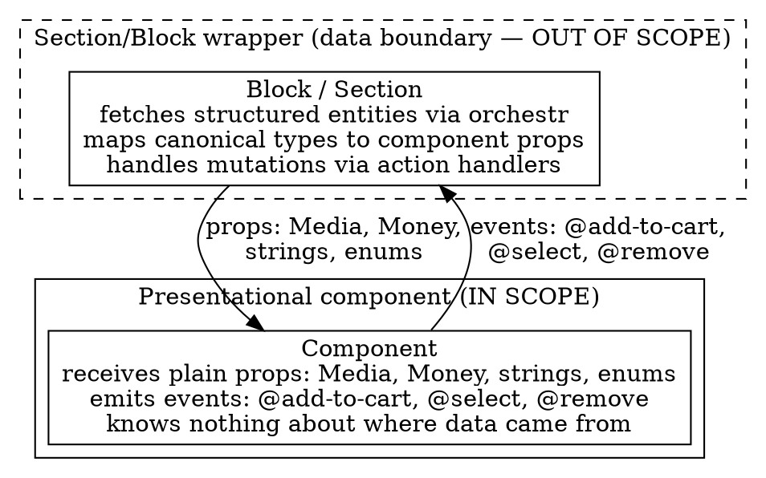
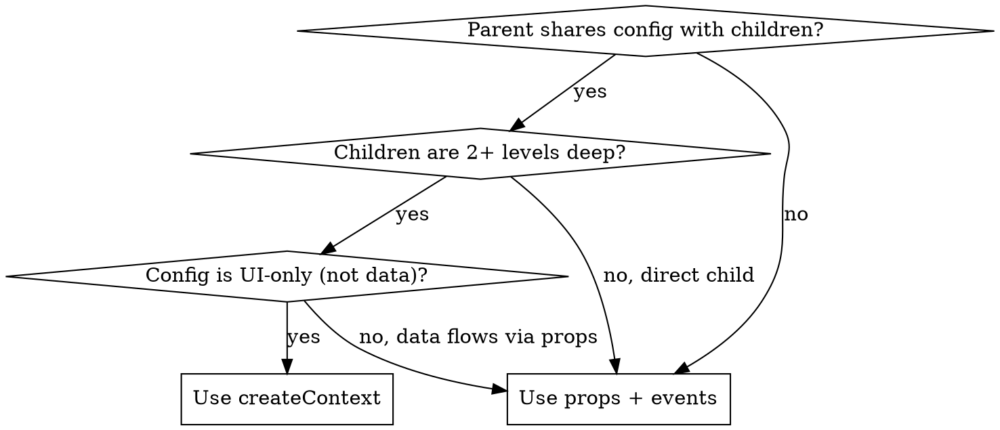

# Core Constraints

The architectural rules that govern every component spec produced by `figma-component-architecture`. Covers the design-system-only scope, the forbidden dependencies (frontend-core, orchestr, page/layout patterns), the value-object types allowed in prop interfaces, the reusable-vs-sub-component classification, and the two permitted state-sharing patterns (props+events, reka-ui `createContext`).

## Design system components only

Components are self-contained, composable design system primitives. They:
- Receive all data via props
- Emit events for user interactions
- Manage only internal UI state (open/close, selected index, animation flags, hover states). States that depend on external async operations (loading, success, error from mutations or fetches) are not internal — they must be received as props from the parent that owns the operation.
- Never fetch data, access stores, or connect to external systems

### Why this separation matters

Presentational components **must not** integrate into the section/block mechanism (`defineSection`/`defineBlock`). Three reasons:

1. **Reusability.** Sections/blocks cannot be rendered without a harness. A component that is a section can only be used inside the section rendering pipeline — it cannot be composed by other developers building custom components on top of existing ones.

2. **Data model decoupling.** Section/Block wrappers receive data as structured entities adhering to `@laioutr-core/canonical-types`. These types are specific to external data sources and may change. Presentational components must not be coupled to canonical entity shapes — their props describe how the component *works and behaves*, not what data model it consumes.

3. **Two-part thinking.** This architecture enforces a clean mental model:
   - **Presentational layer** = props describe component behavior. Can be reused in many contexts.
   - **Data layer (Sections/Blocks + Orchestr)** = structured entities are mapped to component props. Loose coupling between data models and rendering.

   Mixing data operations into components means every change to the data layer (new API, different store, different platform) requires editing component files, even if the UI hasn't changed.

### Data flow



This mapping layer is out of scope for component architecture specs. When a component needs data, spec the props it accepts — the Section/Block wrapper decides how to provide them.

## No page or layout patterns

Skip page-level components that orchestrate data flow, manage route state, or register as sections/blocks. Note them as belonging in a Section/Block wrapper and move on. The test is behavioral, not nominal: if the component could be rendered in Storybook with static props and no data layer, it is presentational — even if its name contains "Layout" or "Page." A responsive two-slot container (e.g., `form` + `summary` columns) is a presentational layout component and should be specced.

## Forbidden dependencies

Presentational components **must never** depend on `frontend-core`, `orchestr`, or any `@laioutr-app/*` package. These packages are data/routing layer concerns. Any import from them in a component file is an architectural violation — it couples the presentational layer to platform internals.

This rule extends beyond direct imports. Accessing state that originates from these packages through Nuxt/Vue globals (`useNuxtApp()`, `useRoute()`, `useRouter()`, `useRuntimeConfig()`) is equally forbidden — these are indirect dependencies on the data/routing layer. If a component needs route-aware behavior (e.g., active link highlighting), accept it as a prop (`active`, `isActive`) and let the Section/Block wrapper determine the value.

**Theme-provided vs prop-provided resources:** Some visual assets (background images, decorative icons, placeholders, empty state illustrations) come from the theme system via `useTheme().image()` rather than from props. The test: does every instance of this component show the same asset (per theme), or does each usage show different data? If the asset varies by theme but not by usage, it belongs in the theme system and is an implementation detail — do not spec a prop for it. If the asset varies per usage (e.g., each product has its own image), it's a `Media` prop. When the analysis is ambiguous (e.g., "accept a Media prop or icon name"), check whether an existing component with similar theme-dependent visuals uses props or `useTheme()`, and flag the ambiguity in Phase 2 if unresolved.

If Phase 1 codebase gathering reveals existing components that violate this rule, do not treat them as precedent — flag them as known violations and follow the rule for new specs.

## Shared types from core-types

Use value-object types from `@laioutr-core/core-types/common` in prop interfaces where they describe presentation concerns:

| Type | Use for |
|---|---|
| `Media` | Images, videos — discriminated union with `type: 'image' \| 'video'` |
| `Money` | Monetary values — `{ amount: number; currency: string }` |
| `Swatch` | Visual representation of a product option (color, gradient, image) |
| `UnitPrice` | Price per unit — `{ price: Money; quantity: Measurement; reference: Measurement }` |
| `Measurement` | Physical measurements (weight, volume, length) |
| `Timespan` | Duration ranges (e.g. delivery estimates) |

All imported from `@laioutr-core/core-types/common`.

**Formatting helpers:** When rendering `Money` or `Measurement` values, use the `$money()` and `$measurement()` helpers available via `#imports` (Nuxt auto-imports). These provide locale-aware formatting — e.g., `$money({ amount: 1099, currency: 'EUR' })` → `"10,99 €"`. Never format these values manually with `toFixed()` or string concatenation. Note this in the spec when a component accepts `Money` or `Measurement` props: *"renders via `$money()`/`$measurement()` for localized formatting."*

**Formatting helper completeness check:** When speccing components that render value types, verify that a formatting helper exists for each type used. If a component accepts `Timespan` but no `$timespan()` helper exists yet, flag the missing helper as a prerequisite in the spec document. Do not assume helpers exist for all value types — `$money()` and `$measurement()` exist, but others may not. Search for `export function $` or `provide.*\$` in the codebase to discover available helpers.

**Why these are allowed but canonical entities are not:** These are *value objects* — small, self-contained types that describe how something looks or costs. They carry no identity, no lifecycle, and no relationships to other entities. Canonical entity types from `@laioutr-core/canonical-types` (e.g., `ProductVariant`, `Product`, `Cart`) are data-model types with identity, components, and links managed by orchestr. Components must never accept entity types as props — the Section/Block wrapper decomposes entities into value objects and primitives.

**Do NOT use `Link`** from core-types — not even as a type-only import. Although `Link` lives in core-types, it cannot be rendered as an `<a>` tag without resolution (e.g., `LinkReference` contains `{ type: 'Product', slug: 'blue-shoe' }`, not a URL). Accepting it as a prop couples the component's API to the platform's routing model. Resolution happens once at the Section/Block boundary, and resolved strings flow down.

**When components need link-behavior differentiation** (e.g., `target="_blank"` for external links, smooth scroll for anchors): decompose the needed attributes into flat props or use a slot.

| Need | Solution |
|---|---|
| Simple navigation | `href: string` prop |
| External links with new tab | `href: string` + `target?: '_blank'` as separate props |
| Full link rendering control | Scoped slot: `#link="{ defaultHref }"` lets parent render `<NuxtLink>` or `<a>` with any attributes |

## Component reusability classification

Every component in the spec must be classified as either **reusable** or **sub-component**. This affects API design, context usage, and export strategy.

| | Reusable | Sub-component |
|---|---|---|
| **Definition** | Self-contained, usable in different contexts | Only meaningful within its parent component |
| **Examples** | ProductTile, Button, Card, Accordion | ProductListItem, AccordionItem, ColorSwatchGroup |
| **Props** | Fully self-contained — all data via props, no parent assumptions | May rely on parent context for shared config (size, orientation, selection state) |
| **createContext** | Never consumes parent context (it IS a potential root) | May consume parent context via `inject*Context()` |
| **Naming** | Standalone name (e.g., `ProductTile`) | `<Parent><Part>` (e.g., `AccordionItem`, `ProductListItem`) |
| **Directory** | Own directory: `components/<Name>/` | Inside parent directory: `components/<Parent>/<ParentPart>.vue` |
| **Export** | Independently importable | Only used through parent — not independently useful |

**How to classify:** If removing the component from its parent's context and placing it in a completely different page/section still makes sense, it's **reusable**. If it would be meaningless or broken without its parent, it's a **sub-component**. Classification drives naming, not the other way around — apply the removal test first, then name accordingly. If a component is named `OrderSummaryTopAccordion` but passes the removal test, it's reusable and should be renamed.

**Composition-only wrappers:** Components that group other components without adding behavior, state, or visual treatment (e.g., a `DeliveryGroup` that just composes `DeliveryEstimate` + `ProductItemList`). These exist for data-flow convenience, not for UI reasons. Classify based on the removal test: if the grouping makes sense in other contexts (order confirmation, tracking page), it's reusable. If it only makes sense within one specific parent, it's a sub-component.

**Structural sub-components vs reusable content:** A compound component pattern often has a structural sub-component (e.g., `AccordionItem`) that renders reusable content via a slot (e.g., `LoyaltyRedemption`). These are two separate components at different classification levels — don't conflate them. The `AccordionItem` is a sub-component of `Accordion`; the `LoyaltyRedemption` rendered inside it may be independently reusable. When you encounter this pattern, decompose into the structural wrapper (sub-component) and the content it renders (classify independently).

**Gray areas:** Some components start as sub-components and evolve into reusable ones (e.g., a `CartItem` designed for `CartSheet` but later used in `OrderSummary`). When unsure, classify as **reusable** — it enforces a more self-contained API, which is easier to relax later than to tighten.

**When the analysis disagrees with the removal test:** If the analysis document explicitly classifies a component (e.g., "private sub-component") but the removal test suggests otherwise, flag the disagreement in Phase 4 (composability check) and let the user decide. The analysis classification may be intentional (keeping scope narrow for v1) or may be an oversight.

**In the spec:** Annotate each component with `(reusable)` or `(sub-component of <Parent>)` next to its name. This classification feeds into the composability check (Phase 4) — sub-components are allowed to be tightly coupled to their parent, but reusable components must not be.

## Two state-sharing patterns only

| Pattern | When | Example |
|---|---|---|
| **Props + events** | Default. Single-level composition, event-driven coordination. | CartSheet -> CartListItem (props down, events up) |
| **createContext (reka-ui)** | Compound components where parent shares UI config with deep children. Never for passing data. | Field -> Input (shares id, error, required, disabled), Accordion -> AccordionItem (shares size) |

No raw provide/inject. No dedicated context files outside the component directory. No Pinia stores within components.

### reka-ui compound delegation

When a component wraps a reka-ui compound primitive (e.g., `RadioGroupRoot`/`RadioGroupItem`, `AccordionRoot`/`AccordionItem`), check whether reka-ui's own internal context provides the shared state children need. If yes, no custom `createContext` is needed — the component is compound by delegation. Only add a custom context layer when sharing UI config that reka-ui does not cover (e.g., `Accordion` adds `size` because reka-ui's accordion context doesn't track sizing).

### Controlled reka-ui components

When the parent must control a reka-ui primitive's state (e.g., which accordion item is open in a step-based flow), use reka-ui's `modelValue`/`v-model` prop to make it controlled. This is standard props+events, not a separate pattern. Document in the spec: *"wraps reka-ui [primitive] in controlled mode — parent drives [state] via props."* Common for step flows (express checkout), single-select tabs, and any case where the parent owns progression logic.

### Render-wrapping with reka-ui structural primitives

A container may wrap reusable children in reka-ui structural elements to add coordination without modifying the child's API. For example, `OrderSummaryTabs` wraps each child in a reka-ui `AccordionItem` to give accordion behavior — the children (e.g., `LoyaltyRedemption`) don't know they're inside an accordion and remain independently usable. This is a composition strategy, not a third state-sharing pattern. Document as: *"default slot with structural wrapping — each child wrapped in [reka-ui element] for [behavior]."*

### createContext convention

```typescript
// In parent's <script lang="ts"> block (non-setup, for export)
import { createContext } from 'reka-ui';
export const [injectFieldContext, provideFieldContext] = createContext<{
  id?: Ref<string>;
  error?: Ref<string | undefined>;
  required?: Ref<boolean>;
  disabled?: Ref<boolean>;
}>('Field');
```

Naming: `inject*Context` / `provide*Context`. Parent calls `provide*Context({...})`, children call `inject*Context()`. Context values are `Ref<T>` or `ComputedRef<T>` for reactivity.

### When to use createContext vs props


