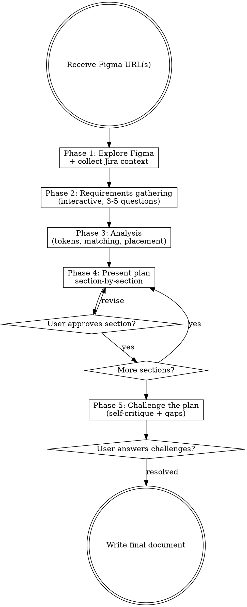

# Figma Design Analysis

## Overview

Analyze Figma designs to produce structured implementation plans through an interactive process. Explores designs via the Figma MCP, gathers requirements interactively, maps tokens, matches existing components, decides package placement, presents findings section-by-section for approval, and challenges its own decisions before finalizing.

**Scope boundary:** This skill plans **presentational components** — standalone, data-agnostic, composable pieces that receive data via props and emit events. Matches against upstream are searched in `@laioutr-core/ui-kit` (atomic primitives) and `@laioutr-core/ui` (commerce organisms); new components you'll author live in your own Nuxt module's `src/runtime/components/` without any layer categorization. This skill does NOT plan section/block wrappers, data integration, page components, page layouts, or Nuxt routing — Section/Block wrappers (which bind components to Studio and to data) are the `writing-section-block-definitions` skill's territory.

Output feeds `figma-component-architecture` (for plans with 3+ components, to spec props/slots/events/state) and then `figma-to-component` for implementation. For trivial single-component plans, `figma-to-component` can consume the analysis directly.

## When to Use

- Analyzing any Figma design before writing code
- Decomposing complex multi-component pages (checkout, PDP, full layouts)
- Creating implementation plans for designs with 3+ components
- Auditing an existing component against its Figma design

**For simple single-component implementations**, use `figma-to-component` directly — it includes lightweight analysis in its "Quick Analysis (standalone mode only)" section, which lists the exact conditions for skipping this skill (one new `.vue` file, no new child components, no compound state, single package, small API).

## Process Flowchart

## Phase Directives

Each phase below names a dedicated reference. Open the reference before executing the phase — the body keeps only orientation; the references are the load-bearing prescriptions. The **Analysis-Phase Mistakes** table at the end of this file is the inline safety net cross-encoding the highest-risk rules.

### Phase 1: Figma Exploration

**Open [`references/phase-1-figma-exploration.md`](references/phase-1-figma-exploration.md)** for: MCP failure handling, exploration strategy, extracting `data-development-annotations` (and the jq recovery recipe), discovering component definitions (dedicated library vs per-component canvas vs no local definitions), capturing per-component Figma links (definition over instance, composition vs variant matrix), recognizing variant matrices, scanning for Jira ticket references.

The Figma MCP requires the **Figma desktop app** open with the target document as the active tab. From URL `https://www.figma.com/design/:fileKey/:fileName?node-id=75-37105`, the node ID is `75:37105` (replace `-` with `:`).

**Two high-frequency rules to keep in mind during exploration:**

- **Annotations only appear in leaf-level `get_design_context` calls.** Section-level calls return sparse metadata WITHOUT annotations — drill into each meaningful subgroup. A sparse response is not "no annotations exist."
- **Composition vs variant matrix determines what to link.** A frame containing different child components assembled together (header + form + summary) is a *composition* → link each child at its definition frame. A frame containing variants of the same component (size × color × state) is a *variant matrix* → link the parent only.

### Phase 2: Requirements Gathering

After Phase 1 exploration, ask 3-5 high-level questions **one at a time** using `AskUserQuestion` (multiple choice, 2-4 options). Only ask questions the Figma data and Jira tickets didn't already answer.

| Category | Example Question | Skip When |
|---|---|---|
| Scope | "The design shows 3 checkout modes. Are all in scope, or should we start with one?" | User already specified scope |
| Constraints | "Are there hard technical constraints? E.g., must work with a specific payment SDK, must support SSR" | Constraints obvious from Jira |
| Priority | "Which part of this design is most critical to get right first?" | Single-component design |
| Integration | "Does this need to integrate with any existing page/flow?" | Integration points clear from context |
| Data | "Where does the data come from? Orchestr handler, API, or static?" | Data flow documented in Jira |

**Rules:**
- One question at a time, not all at once
- 2-4 concrete options per question (not open-ended)
- Skip questions where the answer is obvious from Figma data, Jira tickets, or project context
- Maximum 5 questions total

### Phase 3: Analysis

Three sub-areas, each with its own reference. All are required before assembling the plan.

- **Token mapping** — open [`references/token-mapping.md`](references/token-mapping.md) for: Figma-variable to CSS-custom-property conversion rules, color flattening (`colors/` prefix drop, `greys/` and `overlays/` rewrites), validating hex colors against installed `@laioutr-core/ui-tokens`, verifying tokens against component source, distinguishing direct CSS vars from UnoCSS utility classes.
- **Themable default images** — open [`references/themable-default-images.md`](references/themable-default-images.md) for: when an image is themable (decorative backgrounds, placeholders, empty states), the `themeMedia()` / `themeResponsiveMedia()` helpers, the `Default/Dark/Bright` naming convention for components using `OnBackground`, registering new `ImageName` keys, theme inheritance.
- **Component matching + placement** — open [`references/component-matching-and-placement.md`](references/component-matching-and-placement.md) for: searching the installed `@laioutr-core/ui-kit`/`ui`/`ui-app` source, the common-matches table, REUSE-vs-NEW criteria and modification-intent format, cross-file verification (double processing, dead injection keys, hardcoded config maps, CVA overlaps), the package-placement decision tree, decomposing complex designs ("every region must be accounted for"), and the **Early Exit** path when all components already exist.

### Phase 4: Present Plan Section-by-Section

Instead of assembling the full plan silently, present findings in sections of 200-300 words. After each section, ask the user if it looks right before continuing.

**Presentation order** (follows the output template):

1. Design Intent (+ Jira context)
2. Component Hierarchy (with non-obvious behaviors)
3. Variant Matrix
4. Token Mapping
5. Existing Component Matches + Suggested Modifications
6. Implementation Order
7. Notes for Implementation

After presenting each section, ask: *"Does this section look right, or should I adjust anything before moving on?"*

If the user requests changes, revise and re-present before continuing. If the user says "looks good" or equivalent, proceed to the next section.

### Phase 5: Challenge the Plan

Before writing the final document, challenge the plan in two ways.

**Self-Critique** — Present 3-5 numbered challenges questioning your own decisions:
- Component consolidation: "Should this NEW component share logic with an existing one?"
- Granularity: "Is this NEW component too domain-specific? Could a more generic primitive cover it?"
- REUSE vs NEW: "Could the existing Accordion be extended instead of creating a new one?"

**Unresolved Gaps** — Surface questions the Figma design doesn't answer:
- Missing states (error, loading, empty)
- Missing interactions (cancel/save flows)
- Missing responsive layouts
- Missing skeleton states

Present all challenges as numbered questions. **Wait for user answers before writing the final document.** Unresolved items go into the Open Questions subsection.

## Plan Output

**Open [`references/plan-output-template.md`](references/plan-output-template.md)** for: the full markdown template, the ten key rules every plan must satisfy, and the definition of "non-obvious behavior" worth annotating inline.

Every NEW or REUSE component must include: a Figma link to its **definition** frame (not an instance), status (`NEW`/`EXISTS`/`REUSE`), package placement, modification intent (REUSE only), and any verbatim `_Designer note (<node-id> <name>): "..."_` lines extracted from the Figma MCP. Designer annotations override visual analysis when they conflict.

## Subagent Orchestration

For complex multi-component designs, parallelize exploration using subagents.

**Open [`references/subagent-orchestration.md`](references/subagent-orchestration.md)** for: the parallel exploration pipeline, per-stage subagent prompts (per-group exploration, token mapping, component matching), and constraints (Figma MCP throttling, merge-step criticality, plan-assembly stays in the main agent).

## Phase Priority

Not all phases carry equal weight. If the user asks to compress the process:

| Phase | Priority | Can compress? | Minimum requirement |
|---|---|---|---|
| Phase 1: Explore | **Critical** | No | Must complete fully |
| Phase 2: Requirements | **Critical** | Reduce to 1 question | At least 1 scope/constraint question before outputting any plan |
| Phase 3: Analysis | **Critical** | No | Must complete fully |
| Phase 4: Present | Refinement | Merge into fewer sections | Can present as 2-3 grouped sections instead of 7 |
| Phase 5: Challenge | Refinement | Append non-blocking | Can append challenges as "Open Questions for Review" |

**MUST NOT** output a plan document without at least one user interaction in Phase 2. A plan without scope validation is worse than no plan — it gives false confidence in wrong assumptions.

### Handling "Just give me the plan"

If the user asks to skip the interactive process, do NOT silently comply. Instead:

1. Compress Phase 2 to exactly 1 question — the highest-risk scope decision
2. Run Phase 3 normally (non-interactive anyway)
3. Present Phase 4 as 2-3 grouped sections instead of 7
4. Append Phase 5 challenges as a non-blocking "Open Questions for Review" section in the output

Explain briefly: *"I'll compress this, but I need one question answered first — getting the scope wrong makes the whole plan unusable."*

## Analysis-Phase Mistakes

| Mistake | Fix |
|---|---|
| Not checking for existing components | Always search the upstream `@laioutr-core/ui-kit` (atomic primitives) and `@laioutr-core/ui` (commerce organisms) source (via `node_modules/`) first |
| One component per Figma variant | One component with props -- variants are CSS modifiers |
| Creating a Figma breakpoint prop | Breakpoints are CSS media queries, not props |
| Authoring a new generic primitive when an upstream one exists | Search upstream `@laioutr-core/ui-kit` for atomic primitives and `@laioutr-core/ui` for commerce organisms before proposing NEW |
| Assuming Figma breakpoint count = implementation count | Figma shows all widths; implementation collapses adjacent identical breakpoints |
| Incomplete hardcoded config maps (missing themes) | Always verify maps against `ls node_modules/@laioutr-core/ui-kit/src/runtime/app/theme/` |
| Dead injection keys in types.ts | Verify `provide()`/`inject()` calls exist; remove unused symbols |
| Missing token abstraction layer distinction | Check both direct CSS vars and UnoCSS utilities; flag split concerns |
| No implementation order in plan | Always specify leaf-first order with rationale |
| Plan without issues section | Always run cross-file verification on existing components |
| Proposing NEW when REUSE is viable | Before creating a new component, evaluate if an existing one can be extended |
| Specifying exact props/slots for modifications | Describe modification intent at high level; leave API design to figma-component-architecture skill |
| Dumping entire plan without checkpoints | Present section-by-section in Phase 4; get user approval before continuing |
| Not challenging own decisions | Run self-critique in Phase 5 before finalizing |
| Ignoring Jira ticket references | Scan Figma descriptions for ticket refs; fetch via Jira MCP |
| Documenting obvious behaviors | Only annotate non-obvious behaviors an implementer might miss from a static mockup |
| Missing Figma links on NEW/REUSE components | Every NEW and REUSE component needs a link to its Figma node — without it, the implementation skill must re-explore the full file |
| Linking instance node IDs (with `I` prefix and `;`) | Instance IDs are unstable — link to the parent frame or component definition instead |
| Generic link titles like `[Figma](url)` | Use `{ComponentName} {Qualifier}` format — e.g., `[Accordion Desktop](url)`, `[Summary Expanded](url)` |
| Linking individual variants in a variant matrix | Link the parent frame containing all variants; the implementation skill explores children from there |
| Confusing composition frames with variant frames | Composition = different child components assembled → link children. Variant matrix = same component in different states → link parent |
| Dismissing a designed region as "too simple to be a component" | Every named component/instance/region in the Figma design gets a hierarchy entry. A simple header (logo + back-link) is still a component — simplicity means easy to implement, not "skip it" |
| Linking to component instances instead of definitions | Page compositions contain instances; the component library page has the definitions with all variants. Always explore the file structure (`get_metadata` on `0:0`) to find component library pages and link to definitions |
| Only exploring the provided node, not the file structure | Figma files separate compositions from component definitions. After exploring the given node, call `get_metadata` on `0:0` (document root) to find component library pages (💎, "Components", "Design System") |
| Force-matching external library instances to local definitions | If an instance name has no matching definition in the file's component library, it's from an external Figma file. Mark as external — don't match it to an unrelated local definition |
| Instance name ≠ definition name causing missed matches | Instance names may differ from definition names (e.g., "totals" vs "totals box"). Use `get_design_context` on the instance to find the linked source node ID when names don't match |
| Skipping requirements gathering | Ask scope/constraint/priority questions in Phase 2 unless already answered |
| Skipping all phases because user said "just give me the plan" | Compress to acceleration mode (see Phase Priority); never skip Phase 2 entirely |
| Planning Section/Block wrappers or data integration | This skill plans presentational components only; data binding and Studio wiring live in `defineSection` / `defineBlock` — that's the `writing-section-block-definitions` skill |
| Components that fetch data or call APIs directly | Components must be props-in/events-out; data integration belongs in the Section/Block wrapper |
| Planning page components, layouts, or Nuxt routing | Out of scope; top-level output is a composable organism, not a page |
| Assuming every file has a single "component library" page | Files may use per-component canvas pages (Footer, Navigation, Newsletter) or have no local definitions at all. Classify the file structure first (see step 1 of Discovering Component Definitions) |
| Treating `/`-separated instance names as opaque strings | Parse as `category / component-name / variant` — match on the component-name segment, not the full path |
| Producing an empty plan when all components already exist | Use the Early Exit path — present the hierarchy as confirmation/audit and suggest next steps in the Section/Block wrapper |
| Discarding successful MCP data when later calls fail | Work with partial data from earlier successful calls. Note which nodes could not be explored and ask the user to re-focus Figma |
| Treating themable images as plain image props | Decorative backgrounds, placeholders, and empty states are theme-provided — note as `themeMedia()` / `themeResponsiveMedia()` usage, map to `ImageName` keys, and follow the `Default/Dark/Bright` naming convention if the component uses `OnBackground` |
| Skipping `data-development-annotations` in `get_design_context` output | Each value is a designer-authored note — about optionality, interaction, routing, package placement, or cross-component contracts. Extract every one verbatim with `data-node-id` and `data-name`. For file-form responses, use `jq -r '.[].text' file \| grep -B 2 -A 10 'data-development-annotations='` |
| Reading annotations but not letting them shape the plan | Annotations are inputs, not just text. `-> UI Kit` overrides default placement; `Go to X` is a routing contract reflected in props/events; `optional` means conditional content. If an annotation contradicts your visual analysis, the annotation wins |
| Calling `get_design_context` only at section level | Section-level calls return sparse metadata WITHOUT annotations. Annotations only appear in leaf-level (or near-leaf) calls that return full code. Drill down into each meaningful subgroup |
| Folding designer annotations into "Non-obvious" italic notes | Verbatim designer notes and inferred behavioral notes serve different purposes — reviewers must be able to tell them apart. Use `_Designer note (<node-id> <name>): "<verbatim>"_` for annotations and `_Non-obvious: ..._` for inference |

## Next step: invoke figma-component-architecture

When the final document is written and the user has confirmed it, the plan describes **what** to build (hierarchy, tokens, REUSE-vs-NEW, modification intent) but not **how the components' APIs look** (props, slots, events, state, composition patterns). For any plan with 3+ NEW or REUSE components, that API design happens in `figma-component-architecture` before `figma-to-component` starts writing code.

After delivering the plan, say to the user:

> *"The plan is written. Should I invoke `figma-component-architecture` next to spec props/slots/events/state for the NEW and REUSE components? That's the step that produces the architecture document `figma-to-component` reads when implementing."*

Skip the offer only when:
- The plan has zero NEW components and zero REUSE-with-modification components (Early Exit path — nothing to spec)
- The plan is a single trivial component (`figma-to-component` standalone mode handles it inline)
- The user explicitly states they'll write the architecture spec themselves or skip to implementation

If the user accepts, invoke `figma-component-architecture`. The plan document is its input; it will read existing component APIs, run interactive architecture decisions, and produce the spec.

## Related skills

The Laioutr Figma → component pipeline is: **figma-design-analysis → figma-component-architecture → figma-to-component → writing-section-block-definitions**. This skill is the first step.

- `figma-component-architecture` — the next step for plans with 3+ components. Takes this skill's structural plan (hierarchy, tokens, variant matrix, placement) and produces a props/slots/events/state spec so `figma-to-component` can implement without making design choices. Skip for trivial single-component plans.
- `figma-export-assets` — when the plan includes new raster/SVG assets that must land in `runtime/public/` (non-themable images, partner logos, custom markers, illustrations). Run it during implementation to produce the export spec.
- `figma-to-component` — wiring up the components named by this skill's plan, once tokens, hierarchy, placement, and (for complex plans) the architecture spec are settled.
- `writing-section-block-definitions` — downstream of implementation: builds the `defineSection` / `defineBlock` wrapper that connects the presentational component to data. Out of scope for this skill, but reflected in the plan's Integration Requirements.
