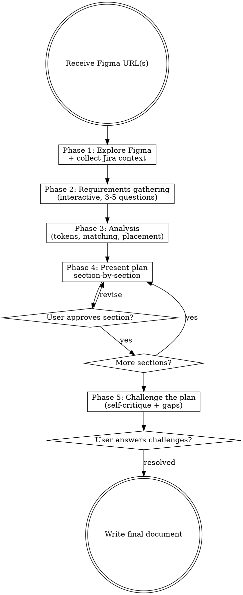
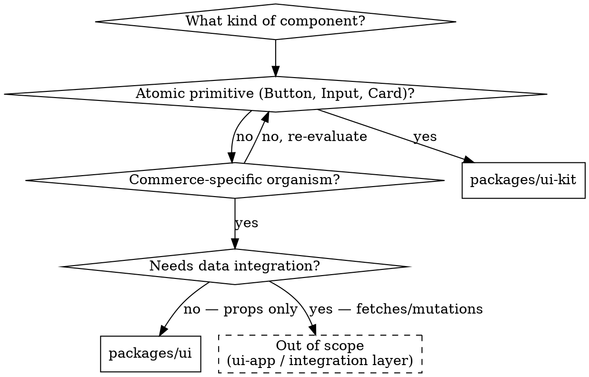
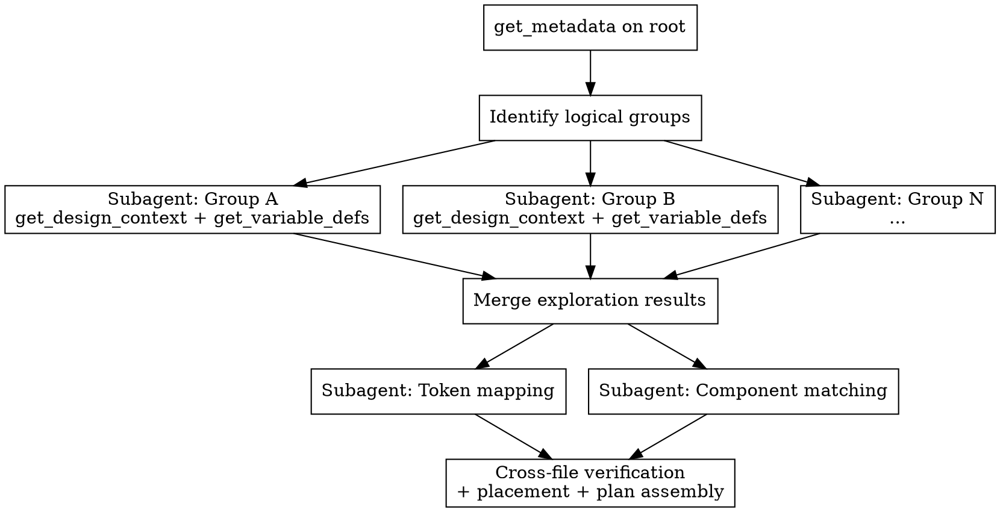

# Figma Design Analysis

## Overview

Analyze Figma designs to produce structured implementation plans through an interactive process. Explores designs via the Figma MCP, gathers requirements interactively, maps tokens, matches existing components, decides package placement, presents findings section-by-section for approval, and challenges its own decisions before finalizing.

**Scope boundary:** This skill plans components for `ui-kit` and `ui` only — standalone, data-agnostic, composable design system components. It does NOT plan `ui-app` sections/blocks, data integration, page components, page layouts, or Nuxt routing. Every component is self-contained: it accepts props, emits events, and can be composed into other components or wrapped by a ui-app Section/Block for data binding.

Output can be executed by `figma-to-component` or `superpowers:executing-plans`.

## When to Use

- Analyzing any Figma design before writing code
- Decomposing complex multi-component pages (checkout, PDP, full layouts)
- Creating implementation plans for designs with 3+ components
- Auditing an existing component against its Figma design

**For simple single-component implementations**, use `figma-to-component` directly -- it includes lightweight analysis.

## Process Flowchart



## Phase 1: Figma Exploration

The Figma MCP requires the **Figma desktop app** to be open with the target document as the active tab.

**MCP failure handling:**
- **"No node could be found"** → Ask the user to open the document in Figma desktop and make it the active tab
- **Intermittent failures** (some calls succeed, then later calls fail) → The Figma app likely lost focus or switched tabs. Ask the user to re-focus the document. Do NOT discard data from earlier successful calls — work with partial data and note which nodes could not be explored
- **Timeout or large output saved to file** → Use `grep` on the saved file to extract specific elements (e.g., `<canvas` tags, `<instance` nodes) rather than reading the full file

### Extracting the Node ID

From URL `https://www.figma.com/design/:fileKey/:fileName?node-id=75-37105`, the node ID is `75:37105` (replace `-` with `:`).

### Exploration Strategy

**For any design, start with `get_design_context`** -- it returns structured code-ready output with component hierarchy, styling, and variable references. Use `clientLanguages: "typescript,vue"` and `clientFrameworks: "vue,nuxt"`.

**For complex multi-component designs** (checkout pages, full layouts):
1. `get_metadata` on the root node to see the full tree structure (names, positions, sizes)
2. Identify logical groups (header, form section, summary, etc.) by node names
3. `get_design_context` on each logical group separately (avoids output size limits)
4. `get_variable_defs` on the root to get all token definitions at once
5. `get_screenshot` on key nodes to visually verify your understanding

**For focused single-component designs** (a button, a card, a banner):
1. `get_design_context` on the node directly (returns code-ready output)
2. `get_variable_defs` on the same node for token definitions
3. `get_screenshot` if the visual layout isn't clear from context alone

### Extracting Dev-Mode Annotations

`get_design_context` embeds designer annotations in the returned code as `data-development-annotations="..."` attributes on the JSX elements. The MCP appends an explicit warning at the end of every response that contains them: *"Some elements have annotation data attributes... IMPORTANT: Do not ignore these annotation attributes."*

These annotations are the only place a designer can record information that is not visible in the layer tree, the screenshot, or the variable list:

| Annotation pattern | Typical meaning |
|---|---|
| `optional section` | The element/region is conditional content; the parent must accept it as a slot or boolean prop |
| `simple accordeon`, `on hover reveals tooltip` | Interaction model that is invisible in a static mockup |
| `Go to {Page}` | Routing contract on a button or link — reflect as part of the component's events/props |
| `New Component -> UI Kit` (or `-> Order Summary`) | Package placement or composition target — overrides the default placement heuristic |
| `... is optional, but at least one is required` | Data-shape contract for a prop |
| `First Image is always the Location Image also used on the location cards` | Cross-component contract — the same data flows into another component |

**Section-level `get_design_context` calls return sparse metadata WITHOUT annotations.** Annotations only appear in leaf-level (or near-leaf) calls that return full code. Drill into each meaningful subgroup; do not stop at the section.

**Annotation values can be multi-line** — newlines inside the attribute value are preserved literally.

**Prefer a dedicated annotation tool when available.** Before using the JSX scan recipe below, check whether your MCP exposes a tool whose name contains `annotation` (e.g. `mcp__figma__get_annotations` — Figma's roadmap mentions a dedicated annotations API in development). A structured tool response is more reliable than regex-parsing JSX strings; fall back to the recipe only when no such tool exists.

**Recovery recipe.** Use jq alone — its `scan` regex matches across the JSON envelope and across embedded newlines in one pass, returning structured `[node-id] name: annotation` rows with no surrounding noise:

```bash
jq -r '
  .[].text
  | [scan("data-node-id=\"([^\"]+)\"[^>]*?data-development-annotations=\"([^\"]+)\"(?:[^>]*?data-name=\"([^\"]+)\")?"; "g")][]
  | "[\(.[0])] \(.[2] // "(no name)"):\n  \(.[1] | gsub("\n"; "\n  "))\n"
' /path/to/saved-output.txt
```

Works for both MCP response forms: the file form is a JSON array `[{type, text}]` where the JSX is a single JSON-encoded string with `\n` escaped; the inline form returned directly into the conversation has the same shape. The pattern relies on `data-node-id` always preceding `data-development-annotations` in the MCP's emitted JSX (verified). `data-name` is captured opportunistically when present.

For quick ad-hoc inspection, `jq -r '.[].text' file | grep -B 2 -A 10 'data-development-annotations='` also works but returns ~10 lines of unrelated attributes per match.

**Brittleness & sanity check.** The recipe assumes (a) the attribute is named `data-development-annotations`, (b) `data-node-id` precedes it on the same element, (c) values are double-quoted with no escaped `"`. If Figma changes any of those, the recipe silently returns zero rows. After running it, sanity-check with:

```bash
jq -r '.[].text' /path/to/saved-output.txt | grep -ci 'annotat'
```

If this finds matches but the recipe returned zero, the output format has changed — visually scan the response for any `data-*annotation*` attribute name (or comment-block / sibling field carrying the notes) and adapt the regex. Do NOT conclude "no annotations exist" unless both the recipe AND this sanity grep return zero.

**For multi-component designs**, do the extraction inside the per-group exploration subagent (see "Subagent Orchestration" below). The 70K+ JSX dump stays in the subagent's context; only the structured annotation list bubbles up.

**Use annotations as inputs to your decisions, not just text to surface:**

- A `-> UI Kit` or `-> {Component}` annotation **overrides** the default package-placement heuristic. Place the component there even if the visual signals (commerce-specific, complex composition) suggest `ui` or `organism`. If an annotation contradicts your visual analysis, the annotation wins.
- A `Go to {Page}` annotation on a button or link is a routing contract — reflect it in the component's planned events or props (e.g., a `to: RouteLocationRaw` prop, or a `@click` event the wrapper Section/Block routes).
- An `optional` annotation means the parent must accept the element as conditional content (slot or boolean prop) — flag it in the modification intent or in the proposed props for the new component.
- An annotation that names another component (e.g., `also used on the location cards`) implies a shared data contract — verify both components have compatible prop shapes, or surface the gap as an Open Question.

**Surface every annotation verbatim in the plan** under a structured `Designer note:` line in the Component Hierarchy (see the plan template). Do NOT fold designer annotations into `Non-obvious:` italic lines — reviewers must be able to distinguish verbatim designer intent from agent inference.

### Discovering Component Definitions

Figma files typically separate **page compositions** (full pages with component instances assembled into layouts) from **component definitions** (detailed designs with all variants and states). When given a page composition, you must find the component definitions.

**Why this matters:** A page composition shows component *instances* — a single checkout header placed in context. The component *definition* shows all variants (Device × Logo position), all states (default, hover, focus), and detailed styling. The implementation skill needs the definition, not just the instance.

**How to find component definitions:**

1. **Explore the file's page structure.** Call `get_metadata` on `0:0` (the document root) to see all top-level pages/canvases. The result can be very large (100K+ characters for files with many pages) — if it exceeds the output limit and is saved to a file, grep for `<canvas` tags to extract page names and IDs only. Classify the file into one of three patterns:

   - **Dedicated component library page** — Look for pages named "💎 Components", "Component Library", "Design System", or similar. This is the ideal case (see step 2a).
   - **Per-component canvas pages** — Each canvas is a component category (e.g., "Footer", "Navigation", "Newsletter", "404"). There is no single library page; definitions are distributed across named canvases. This is common in "Component-Examples" or showcase files (see step 2b).
   - **No component definitions at all** — The file contains only page compositions assembled from external instances. All component definitions live in other Figma files (see step 2c).

2a. **Dedicated library page.** Call `get_metadata` on the library canvas to see its sections and definition frames. This gives you the full inventory of component definitions in the file.

2b. **Per-component canvas pages.** Match instances on the composition to canvas pages by name. For instance `headers/ basic shop header / desktop` on a file with a "Navigation" canvas — explore that canvas for the definition. For `basic / desktop` with a "Footer" canvas — explore that canvas. Each canvas may contain variant definitions (desktop/mobile, expanded/collapsed) for that component category.

2c. **No local definitions.** The file is purely compositional — all components are instantiated from external Figma libraries. Link to the composition nodes directly and mark all instances as external. Consider whether the user should analyze the source file instead (see "Early Exit" below).

3. **Match instances to definitions.** When `get_metadata` on a page composition shows `<instance>` nodes (e.g., `<instance id="75:81197" name="Checkout Header" />`), look for matching frames on the component library page or the relevant canvas page. Match by name — but instance names may differ from definition names (e.g., instance "totals" → definition "totals box"). When uncertain, use `get_design_context` on the instance to find the linked source node ID and cross-reference with definition IDs.

4. **Parse path-structured instance names.** Figma instances often use `/`-separated paths: `headers/ basic shop header / desktop`. Parse these as `category / component-name / variant`. The component name is the middle segment (`basic shop header`); the last segment is typically a breakpoint or variant (`desktop`, `mobile`); the first segment is a category grouping (`headers`). Use the component name for matching — search for "basic shop header" or "shop header" on the library/canvas pages, not the full path string.

5. **Prefer definition links over instance links.** In the Component Hierarchy, link to the component **definition frame** (where all variants are shown), not to the instance on the page composition. The definition frame gives the implementation skill access to all variant combinations.

6. **Handle external library components.** Compositions frequently use instances from *other* Figma files (shared design system libraries). If an instance name has no matching definition on any library page or canvas page within the file, it is an external component. Mark it in the hierarchy with its source context (e.g., "EXISTS — external, from main design system"). Do NOT force-match it to an unrelated local definition.

**Example (dedicated library):** The checkout page at `75:37105` contains an instance `75:81197` named "Checkout Header". The same file has a "💎 Checkout Components" page at `1:47` with a "Checkout Header" definition frame at `66:20116` containing 4 variants (Device × Logo position). Link to `66:20116`, not `75:81197`.

**Example (per-component canvases):** The "Component-Examples" file has canvases named "Footer", "Navigation", "Newsletter", "404", etc. An instance `basic / desktop` on the 404 composition maps to the "Footer" canvas. An instance `headers/ basic shop header / desktop` maps to the "Navigation" canvas. Explore each canvas to find the definition frames with all variants.

### Capturing Per-Component Figma Links

During exploration, **record Figma links for each component you identify**. Every NEW or REUSE component in the Component Hierarchy must include links to its relevant Figma nodes. This enables the `figma-to-component` implementation skill to locate the exact design without re-exploring the full file.

**How to capture node IDs:**
- `get_metadata` returns node IDs for every element in the tree — map logical groups to their IDs
- `get_design_context` responses reference specific nodes — note which node corresponds to which planned component
- **Prefer component definition nodes** over instance nodes — if a component library page exists, link to the definition frame (with all variants) rather than the instance on the page composition (see "Discovering Component Definitions")

**Node ID → URL:** Given file key from the root URL and node ID `75:37105`, the component link is:
`https://www.figma.com/design/{fileKey}/{fileName}?node-id=75-37105` (replace `:` with `-` in the node ID). For Figma instance nodes (IDs like `I8:64336;11:32401`), link to the parent frame or component definition instead — instance IDs are unstable and don't produce reliable URLs.

**Link title format:** `{ComponentName} {Qualifier}` where Qualifier is the breakpoint (`Mobile`, `Desktop`, `Tablet`) or state (`Expanded`, `Collapsed`, `Error`). Use developer-friendly names, not raw Figma layer names. Examples: `[Accordion Desktop](url)`, `[Order Summary Expanded](url)`, `[CTA Banner All Variants](url)`.

**What to link and how many:**
- **Separate responsive layouts** — If the design has distinct desktop and mobile frames in different nodes, link both: `[ContactSection Desktop](url)`, `[ContactSection Mobile](url)`
- **State variants** — If a component has visually distinct states in separate frames (collapsed/expanded, empty/filled, error/success), link those too: `[Order Summary Collapsed](url)`, `[Order Summary Expanded](url)`. State links count toward the per-component budget.
- **Variant matrices** — When a single parent frame contains many variant combinations (breakpoint × size × fill × alignment — potentially hundreds of children), link to the **parent frame only**. The implementation skill can explore individual variants from there.
- **Composition frames vs variant frames** — A frame containing *different* child components assembled together (a checkout section with header, form, and summary) is a composition — link the individual children. A frame containing *variants of the same component* (breakpoint × size × color) is a variant matrix — link the parent.
- **Don't over-link** — 1-3 links per component is typical. If you find yourself adding more, you're probably linking individual variants instead of their parent frame. Link each unique component *type* once, not each instance (if `InputField` appears 8 times, one representative link is enough).
- **Missing counterparts** — If a frame is named "... / mobile" or "... / desktop" and the counterpart is not in scope, note it as a gap in Open Questions so the implementation skill knows to look for it.

**Use subagents for large Figma files** -- see "Subagent Orchestration" section below for the parallel pipeline.

### Recognizing Figma Variant Matrices

Figma designers often enumerate all combinations of component properties in a grid. A node with hundreds of children that look identical except for small differences is a **variant matrix**. Example: 384 children = 4 breakpoints x 3 sizes x 2 fills x 8 alignments x 2 color modes x 3 ratios.

In code, this reduces to a **single component with props**. Each Figma axis becomes a prop. The breakpoint axis is NOT a prop -- it's handled by CSS media queries.

**Figma breakpoints != implementation breakpoints.** Figma may show variants at 7 widths (initial, xs, s, sm, md, lg, xl), but the implementation typically collapses several into fewer `@media` queries. Check which breakpoints actually cause layout or spacing changes -- adjacent breakpoints with identical styling should be merged. Document which Figma breakpoints are collapsed.

### Jira Ticket Context

During exploration, scan Figma component descriptions and layer names for Jira ticket references (e.g., `PROJECT-123`, `TEAM-456` — match whatever project keys your team uses). Also accept ticket references provided directly by the user.

For each ticket found, fetch context using the Jira MCP (`getJiraIssue`) to retrieve summary, description, and acceptance criteria. Include gathered ticket context in the Design Intent section of the output document.

If the Jira MCP is unavailable, note the ticket references and ask the user to provide the relevant context manually.

## Phase Priority

Not all phases carry equal weight. If the user asks to compress the process:

| Phase | Priority | Can compress? | Minimum requirement |
|---|---|---|---|
| Phase 1: Explore | **Critical** | No | Must complete fully |
| Phase 2: Requirements | **Critical** | Reduce to 1 question | At least 1 scope/constraint question before outputting any plan |
| Phase 3: Analysis | **Critical** | No | Must complete fully |
| Phase 4: Present | Refinement | Merge into fewer sections | Can present as 2-3 grouped sections instead of 7 |
| Phase 5: Challenge | Refinement | Append non-blocking | Can append challenges as "Open Questions for Review" |

**MUST NOT** output a plan document without at least one user interaction in Phase 2. A plan without scope validation is worse than no plan — it gives false confidence in wrong assumptions.

### Handling "Just give me the plan"

If the user asks to skip the interactive process, do NOT silently comply. Instead:

1. Compress Phase 2 to exactly 1 question — the highest-risk scope decision
2. Run Phase 3 normally (non-interactive anyway)
3. Present Phase 4 as 2-3 grouped sections instead of 7
4. Append Phase 5 challenges as a non-blocking "Open Questions for Review" section in the output

Explain briefly: *"I'll compress this, but I need one question answered first — getting the scope wrong makes the whole plan unusable."*

## Phase 2: Requirements Gathering

After Phase 1 exploration, ask 3-5 high-level questions **one at a time** using `AskUserQuestion` (multiple choice, 2-4 options). Only ask questions the Figma data and Jira tickets didn't already answer.

| Category | Example Question | Skip When |
|---|---|---|
| Scope | "The design shows 3 checkout modes. Are all in scope, or should we start with one?" | User already specified scope |
| Constraints | "Are there hard technical constraints? E.g., must work with a specific payment SDK, must support SSR" | Constraints obvious from Jira |
| Priority | "Which part of this design is most critical to get right first?" | Single-component design |
| Integration | "Does this need to integrate with any existing page/flow?" | Integration points clear from context |
| Data | "Where does the data come from? Orchestr handler, API, or static?" | Data flow documented in Jira |

**Rules:**
- One question at a time, not all at once
- 2-4 concrete options per question (not open-ended)
- Skip questions where the answer is obvious from Figma data, Jira tickets, or project context
- Maximum 5 questions total

## Phase 3: Analysis

This phase combines token mapping, component matching, and package placement.

### Token Mapping

Build an explicit mapping table from Figma variable names to CSS custom properties.

#### Conversion Rules

Figma uses `/` separators and mixed case. CSS variables use `-` separators and lowercase.

| Figma Variable | CSS Variable | Rule |
|---|---|---|
| `Spacing/SM` | `var(--spacing-sm)` | Category/Size -> lowercase, `/` -> `-` |
| `Spacing/2XL` | `var(--spacing-2-xl)` | Numbers get `-` separator |
| `font size/M` | `var(--font-size-m)` | Space in category -> `-` |
| `font size/4XL` | `var(--font-size-4-xl)` | Same number rule |
| `font/weight/600` | `var(--font-weight-600)` | Numeric values stay as-is |
| `font/family/heading` | `var(--font-family-heading)` | Direct mapping |
| `colors/primary/9` | `var(--primary-9)` | `colors/` prefix is DROPPED |
| `colors/grey/12` | `var(--grey-12)` | Same drop rule |
| `greys/stone_grey/5` | `var(--stone-grey-5)` | `greys/` dropped, `_` -> `-` |
| `overlays/white_alpha/7` | `var(--overlay-white-alpha-7)` | `overlays/` -> `overlay-`, `_` -> `-` |
| `buttons/primary/default/bg-color` | `var(--buttons-primary-default-bg-color)` | Component tokens: direct `/` -> `-` |
| `buttons/border-radius` | `var(--buttons-border-radius)` | Direct mapping |
| `forms-border-radius` | `var(--forms-border-radius)` | Already CSS-compatible |
| `border radius/SM` | `var(--border-radius-sm)` | Space -> `-`, lowercase |
| `text/primary` | `var(--text-primary)` | Semantic tokens: direct |
| `text/always-white` | `var(--text-always-white)` | Direct mapping |

#### Key Pattern: Color Flattening

The token build pipeline flattens color group hierarchies:

```
Figma path          -> CSS variable
colors.primary.9    -> --primary-9         (colors/ prefix dropped)
greys.stone_grey.5  -> --stone-grey-5      (greys/ prefix dropped, _ -> -)
overlays.white_alpha.7 -> --overlay-white-alpha-7 (overlays/ -> overlay-)
```

#### Validating Hex Colors

When Figma provides a hex color (e.g., `#743dcd`), check if it matches an existing token:

```bash
# Search all token files for a hex value (case-insensitive)
grep -ri "743dcd" packages/ui-tokens/src/figma/

# If not in base tokens, check theme-specific tokens
grep -ri "743dcd" packages/ui-tokens/src/figma/theme.*.tokens.json
```

1. If found, trace the JSON path to derive the CSS variable name using the conversion rules above
2. If NOT found in any token file, flag it to the user -- hardcoded colors are almost always a mistake

#### Verifying Tokens Against Source Code

When analyzing an **existing** component, verify your Figma-derived token mapping against the actual source.

```bash
# Extract all CSS variable references from a component
grep -oP 'var\(--[\w-]+\)' packages/ui/src/runtime/components/section/ComponentName/ComponentName.vue | sort -u

# Also check for v-bind() usage (Vue dynamic CSS bindings)
grep -oP 'v-bind\(\w+\)' packages/ui/src/runtime/components/section/ComponentName/ComponentName.vue
```

Compare the source token list against your Figma mapping. Discrepancies indicate either:
- **Tokens in Figma but not in code**: may be handled by parent/child components or global styles
- **Tokens in code but not in Figma**: may be hardcoded fallbacks or implementation-specific additions
- **Hardcoded pixel values in code**: should be flagged

#### Distinguishing Token Abstraction Layers

Spacing tokens can be applied via **direct CSS variable references** (`var(--spacing-l)`) or via **UnoCSS utility classes** (`py-l`, `s:py-xl`, `sm:py-2xl`). When auditing, check both:

```bash
# Direct CSS vars
grep -oP 'var\(--[\w-]+\)' ComponentName.vue | sort -u
# UnoCSS utilities in CVA or template classes
grep -oP '(py|px|ps|pe|p|m|gap)-[\w-]+' cmsImageTextClasses.ts | sort -u
```

Document which layer handles which tokens. If the same spacing concern is split across both layers, flag it as a maintenance risk.

### Themable Default Images

Components sometimes provide default decorative images (backgrounds, illustrations, empty states, placeholders) that vary by theme and optionally by breakpoint or color mode. These are theme-provided assets rendered via the `Media` component, not content from APIs.

This section covers the **themable** image lane only. For one-off images that ship as files in `runtime/public/` and don't belong in any `ImageSet` (component-specific photos/illustrations, partner logos, custom markers, raster CTA backgrounds), use the `figma-export-assets` skill — it owns format/scale/destination/filename decisions and the export spec.

**Image classification:**

| Category | Source | Themable? | Example |
|---|---|---|---|
| Product content | API data layer, arrives as `Media` prop | No | Product photo in a card |
| Product placeholder | Theme `ImageSet`, shown when API data is missing | Yes | `placeholder1x1Product` |
| Empty state illustration | Theme `ImageSet`, shown when a list/section is empty | Yes | `emptyStateBox` |
| Decorative background | Theme `ImageSet`, component visual design | Yes | `bannerBasicDefault` |
| Brand/partner assets | External URLs or icon set (`logos/*` in shared icons) | No | PayPal logo, Visa badge |
| Inline decorative SVGs | Hardcoded in component template or CSS | No | Wave divider, border pattern |

**How to identify in Figma:** Look for images that:
- Serve as backgrounds, illustrations, placeholders, or empty states
- Would logically change per theme (even if the Figma file only shows one theme)
- Change depending on background brightness (dark vs light versions) — if the component uses `OnBackground`
- Have different aspect ratios or crops for mobile vs desktop

Even if the Figma file shows only one theme variant, any non-product, non-brand decorative image should be assumed themable. The codebase convention is that ALL such images are theme-provided.

**NOT themable:** inline SVGs embedded directly in the template, CSS-generated decorative elements (gradients, shapes via `::before`/`::after`), and external brand logos.

**Registration helpers:**

| Helper | When | Result |
|---|---|---|
| `themeMedia(path, w, h, color, ext, scales)` | Same image for all breakpoints | Single `MediaImage` |
| `themeResponsiveMedia(path, mobileW, mobileH, desktopW, desktopH, color, ext, scales)` | Separate `{path}-mobile.{ext}` and `{path}-desktop.{ext}` | Single `MediaImage` with responsive sources |

Images are registered per theme in `ImageSet` (`packages/ui-kit/src/runtime/app/types/theme.ts`). Each entry is a `MediaImage` or a `[MediaImage, MediaImage]` tuple for `[light, dark]` color modes.

**Brightness-based naming convention:** Components using `OnBackground` typically require **three** `ImageName` entries:

| Key | Type | When used |
|---|---|---|
| `{prefix}Default` | `[MediaImage, MediaImage]` tuple | `backgroundBrightness` is `'light'` — element 0 for light color mode, element 1 for dark |
| `{prefix}Dark` | `MediaImage` | `backgroundBrightness` is `'dark'` |
| `{prefix}Bright` | `MediaImage` | `backgroundBrightness` is `'bright'` |

Example: `bannerBasicDefault`, `bannerBasicDark`, `bannerBasicBright`.

**Consumption in components:**

```typescript
const theme = useTheme();
const bg = theme.image('bannerBasicDefault'); // auto-resolves [light,dark] tuple
```

Pass the result to `<Media :media="bg" />`.

**Theme inheritance:** The base theme (`laioutr.ts`) must define all images. Child themes (`classic`, `sunny`, `tech`) only override images that differ from their parent via `extendTheme()`. When proposing new `ImageName` entries, the base theme needs the new key at minimum.

**In the analysis plan:** Note themable images as behavioral notes in the Component Hierarchy and map them to `ImageName` keys. If no existing `ImageName` matches, flag that a new entry needs to be added to the `ImageName` type and the base theme's `ImageSet`. (`ImageName` includes `| (string & {})` for extensibility, but explicit entries are still required — they provide IDE autocomplete and document the image contract.)

```markdown
- **BannerHero** (packages/ui/organism) -- NEW
  - _Themable default image: background illustration varies by theme, breakpoint, and color mode (3 keys: Default/Dark/Bright). Uses themeResponsiveMedia()._
```

### Component Matching

Before planning ANY new component, search the existing inventory.

**Prefer modifications to existing components over creating new ones.** Before proposing a NEW component, evaluate whether an existing component can be extended. Mark such components as REUSE.

#### Search Process

```bash
# 1. Check ui-kit components (73 atomic components)
ls packages/ui-kit/src/runtime/app/components/

# 2. Check ui components (140 commerce organisms)
ls packages/ui/src/runtime/components/
ls packages/ui/src/runtime/components/organism/

# 3. Check ui-app sections and blocks (for page-level designs)
ls packages/ui-app/src/runtime/app/section/
ls packages/ui-app/src/runtime/app/block/
ls packages/ui-app/src/runtime/app/shared-fields/

# 4. Search by keyword from the Figma design
grep -r "ComponentNameFromFigma" packages/ui-kit/src/ packages/ui/src/ packages/ui-app/src/
```

#### Common Matches

| Figma Element | Existing Component | Import Path |
|---|---|---|
| Text / Heading / Body / Caption | CSS classes (deprecated `Text`) | Use `heading-m`, `body-s`, `caption-xs` etc. on semantic HTML elements |
| Button (any variant) | `Button` | `#ui-kit/components/Button/Button.vue` |
| Button adapting to background | `BackgroundAwareButton` | `#ui-kit/components/BackgroundAwareButton/BackgroundAwareButton.vue` |
| Icon | `Icon` | `#ui-kit/components/Icon/Icon.vue` |
| Image / Media | `Media` | `#ui-kit/components/Media/Media.vue` |
| Input / Text Field | `Input` | `#ui-kit/components/Input/Input.vue` |
| Form Field (label + input + error) | `Field` | `#ui-kit/components/Field/Field.vue` |
| Checkbox | `InputCheckbox` | `#ui-kit/components/InputCheckbox/InputCheckbox.vue` |
| Dropdown / Select | `Select` | `#ui-kit/components/Select/Select.vue` |
| Card container | `Card` | `#ui/components/Card/Card.vue` |
| Dialog / Modal | `Dialog` | `#ui-kit/components/Dialog/Dialog.vue` |
| Accordion | `Accordion` + `AccordionItem` | `#ui-kit/components/Accordion/` |
| Star rating display | `StarsRating` | `#ui-kit/components/StarsRating/StarsRating.vue` |
| Color swatch | `ColorSwatch` | `#ui-kit/components/ColorSwatch/ColorSwatch.vue` |
| Product tile | `ProductTileBasic` | `#ui/components/organism/ProductTileBasic/` |
| CTA Banner base | `CtaBannerBase` | `#ui-kit/components/CtaBanner/CtaBannerBase.vue` |
| Product flags (sale/new/promo) | `ProductTileFlag` | `#ui-kit/components/ProductTileFlag/` |
| Progress bar | `ProgressBar` | `#ui-kit/components/ProgressBar/ProgressBar.vue` |
| Loading spinner | `LoadingSpinner` | `#ui-kit/components/LoadingSpinner/` |
| Navigation menu | `NavigationMenu` + subcomponents | `#ui-kit/components/NavigationMenu/` |

**Always compose from existing components. Never recreate primitives.**

#### Describing Modification Intent (REUSE Components)

For each existing component that needs modification, describe **what** needs to change and **why** at a high level. Do NOT specify exact props/slots — that's for a future component-architecture skill.

**Good:** "RadioSelectItem needs to support expandable content when selected and a custom icon area — the checkout shipping selector shows a radio that reveals delivery date options on selection."

**Bad:** "Add an `expandable` prop of type boolean and a `#icon` slot to RadioSelectItem."

#### Cross-File Verification

When analyzing an existing component with a **section wrapper** (e.g., `SectionBrandHero` wraps `BrandHero`), trace props from the wrapper into the presentation component:

1. **Check for double processing** -- If the wrapper calls a utility (e.g., `colorValueToCss`) on a value and then the inner component calls it again, flag it. Classify severity: if the function is idempotent on its own output, it's a code smell / confused responsibility rather than a functional bug.
2. **Check for prop/schema mismatches** -- If the inner component accepts a prop value but the section schema doesn't expose it as an option, flag the discrepancy.
3. **Check for dead injection keys** -- If `types.ts` defines an `InjectionKey` / `Symbol`, verify that matching `provide()` and `inject()` calls exist in the component tree. Unused injection keys are dead code.
4. **Check for duplicate CVA classes** -- If the same CSS class is added by multiple CVA definitions, flag the redundancy.
5. **Check for overlapping CVA compound variants** -- When multiple compound variants can match simultaneously, trace which utility classes apply and whether they conflict. Dense padding/margin compound variants with breakpoint overrides are especially error-prone.
6. **Check for fragile CSS coupling** -- If CSS selectors reference another component's internal class names (e.g., MediaText targeting `.cards-container__inner` from Backdrop), flag as fragile coupling.
7. **Check for hardcoded config maps** -- If a component has a hardcoded map keyed by theme ID, verify completeness:

```bash
# List all registered themes
ls packages/ui-kit/src/runtime/app/theme/

# Compare against hardcoded keys in the component
grep -n "laioutr\|classic\|tech\|sunny\|strawberry" packages/ui/src/runtime/components/section/ComponentName/ComponentName.vue
```

Missing entries in hardcoded maps are silent bugs -- they fall back to defaults without error.

### Package Placement

**This skill only plans components for `ui-kit` and `ui`.** Components in these packages are design system building blocks — they receive data via props and emit events, with no direct connection to external systems (APIs, Orchestr handlers, Pinia stores, payment SDKs). Data integration happens exclusively at the `ui-app` layer, which is out of scope for this skill.



| Package | Component Type | Examples | Directory | In scope? |
|---|---|---|---|---|
| `ui-kit` | Atomic, reusable across contexts | Button, Card, Icon, Input, Dialog | `src/runtime/app/components/` | **Yes** |
| `ui` component | Mid-level commerce compositions | DarkModeSwitch, RatingInput, SwatchItem | `src/runtime/components/<Name>/` | **Yes** |
| `ui` organism | Complex page sections | Header, Footer, CartSheet, ProductGrid | `src/runtime/components/organism/<Name>/` | **Yes** |
| `ui-app` section | `defineSection()` page sections with data binding | CmsContainer, BrandHero | `src/runtime/app/section/` | No |
| `ui-app` block | `defineSection()` blocks with data binding | — | `src/runtime/app/block/` | No |

### Decomposing Complex Designs

For multi-component designs (checkout flows, full pages):

1. **Identify visual boundaries** -- Each distinct section with its own background, padding, or card container is a candidate component
2. **Check Figma layer names** -- Designers name layers semantically (e.g., "Order Summary", "Payment Form", "Cart Items")
3. **Map to component hierarchy** -- every component is either composed into another component or will eventually be wrapped by a Section/Block in ui-app:
   - Top-level visual groups -> organisms in `ui/components/organism/`
   - Repeated patterns -> components in `ui/components/<Name>/`
   - Atomic elements -> already exist in `ui-kit`
4. **Start from leaves** -- Plan implementation of innermost components first, then compose outward
5. **One component per Figma logical group** -- Don't create a component for every Figma frame; group by semantic meaning

**Every region of the design must be accounted for.** If a designer created a named component, instance, or visually distinct region in the Figma design, it MUST appear in the Component Hierarchy — as NEW, EXISTS, or REUSE. You do not get to decide that something is "too simple to be a component" or "barely warrants its own component." A checkout header with just a logo and a back-link is still a component. A footer with just legal links is still a component. Simplicity is not a reason to omit — it just means the component is easy to implement.

**The only things excluded from the hierarchy are:**
- Pure text content that maps to CSS typography classes (headings, body text, captions)
- Standard HTML elements that don't need a Vue component wrapper (a `<hr>` divider, a plain `<a>` link)
- Layout primitives that are just CSS (a flex container, a grid wrapper) — unless the designer gave them distinct visual treatment (background, border, padding that makes them a "card" or "section")

**Hidden elements:** Include elements marked `hidden="true"` in the hierarchy but annotate them as `[hidden]`. Hidden elements represent alternate states (e.g., an expanded form hidden in the collapsed view) or optional features (e.g., a focus ring). They are important for understanding the full interaction model.

**Layout frames vs semantic components:** When `get_metadata` shows plain `<frame>` nodes (not `<instance>` or `<symbol>`), distinguish between:
- **Semantic frames** that represent a distinct UI concept (e.g., "express checkout method", "account", "shipping") — these need their own Vue component
- **Structural frames** that are just CSS layout containers (e.g., "main", "content", "left", "right", "row 30/70") — these become `<div>` elements with CSS, not Vue components

Mark structural frames as `(layout)` in the hierarchy so the implementation skill knows they are CSS-only. If in doubt, it's a semantic component — err on the side of creating components.

### Early Exit: All Components Already Exist

After decomposing and matching, if the hierarchy contains **zero NEW or REUSE components** (everything is EXISTS or external), the design does not require new ui-kit/ui work. Instead of producing an empty plan:

1. **Tell the user:** "All components in this design already exist. No new ui-kit or ui work is needed."
2. **Present the hierarchy anyway** as a confirmation/audit — it maps Figma regions to existing components, which is still valuable for verification.
3. **Suggest next steps:** The work may be at the ui-app layer (creating a Section/Block that assembles these existing components) or at the page layout level — both are outside this skill's scope.
4. **Skip Phases 4-5** (section-by-section presentation and challenge) — they add no value when there's nothing to plan.

This commonly happens when analyzing page compositions from "component examples" or showcase files where all UI elements are already implemented.

**Do NOT plan page components, page layouts, or Nuxt routing.** Those are Nuxt-layer concerns handled outside this skill's scope. The top-level output of this skill is always a self-contained, composable component (organism) that can be placed anywhere via a ui-app Section/Block wrapper.

## Phase 4: Present Plan Section-by-Section

Instead of assembling the full plan silently, present findings in sections of 200-300 words. After each section, ask the user if it looks right before continuing.

**Presentation order** (follows the output template):

1. Design Intent (+ Jira context)
2. Component Hierarchy (with non-obvious behaviors)
3. Variant Matrix
4. Token Mapping
5. Existing Component Matches + Suggested Modifications
6. Implementation Order
7. Notes for Implementation

After presenting each section, ask: *"Does this section look right, or should I adjust anything before moving on?"*

If the user requests changes, revise and re-present before continuing. If the user says "looks good" or equivalent, proceed to the next section.

## Phase 5: Challenge the Plan

Before writing the final document, challenge the plan in two ways.

### Self-Critique

Question your own decisions. Present 3-5 numbered challenges:

- Component consolidation: "I'm proposing CheckoutTotalsBox as NEW — should it share logic with the existing CartSummaryBox instead?"
- Package placement: "I put all components in packages/ui but some of these might be generic enough for ui-kit."
- REUSE vs NEW: "I'm suggesting a NEW CheckoutAccordion but the existing Accordion component might work with styling modifications."

### Unresolved Gaps

Surface questions the Figma design doesn't answer:

- Missing states: "The design shows a loyalty points flow but doesn't specify error states."
- Missing interactions: "The express checkout accordion shows edit mode but there's no cancel/save interaction defined."
- Missing responsive behavior: "No mobile layout is shown for the multi-delivery grouping."
- Missing loading/empty states: "No skeleton states are shown for the order summary."

Present all challenges as numbered questions. **Wait for user answers before writing the final document.** Unresolved items go into the Open Questions subsection.

## Plan Output Format

The analysis must produce a structured plan document. This is the primary deliverable.

### Template

```markdown
# Design Analysis: [Component/Page Name]

Figma: [URL]
Analyzed: [date]

## Design Intent

[Brief description of what the design achieves as a whole — 2-3 sentences on UX goals]

### Jira Context

| Ticket | Summary | Key Acceptance Criteria |
|---|---|---|
| PROJECT-123 | [summary from Jira] | [key criteria] |
| ... | ... | ... |

[If no Jira tickets: omit this subsection]

## Component Hierarchy

- **ComponentA** (packages/ui-kit) -- NEW — [Desktop Layout](https://www.figma.com/design/fileKey/fileName?node-id=75-37105), [Mobile Layout](https://www.figma.com/design/fileKey/fileName?node-id=75-38200)
  - SubComponentB (packages/ui) -- EXISTS at `#ui/components/SubComponentB/`
  - SubComponentC (packages/ui-kit) -- EXISTS at `#ui-kit/components/SubComponentC/`
  - _Designer note (75:37105 ComponentA root): "New Component -> UI Kit" — placement set per annotation, overrides default ui/organism heuristic_
  - _Designer note (I75:37105;13:4105 "Details" button): "Go to Location Detail Page — 1) default location detail page type, 2) or link to custom page / pagetype" — routing contract; reflected as `to: RouteLocationRaw` prop_
  - _Non-obvious: hover on SubComponentB reveals tooltip with delivery estimate; collapsed → expanded transition on selection_
- **ComponentD** (packages/ui/organism) -- NEW — [Form Variants](https://www.figma.com/design/fileKey/fileName?node-id=80-42000)
  - Field, Input, Select -- EXISTS in ui-kit
- ExistingComponent (packages/ui/organism) -- REUSE — [Current Design](https://www.figma.com/design/fileKey/fileName?node-id=90-55000)
  - _Modification intent: needs to support expandable content on selection and a custom icon area_

Legend: **bold** = needs implementation, normal = exists, _Designer note (node-id name): "verbatim"_ = a `data-development-annotations` value extracted from the Figma MCP, _Non-obvious: ..._ = behavioral note inferred from the design, _Modification intent: ..._ = REUSE component change rationale, [Link Title](url) = Figma design for this component

## Variant Matrix

| Axis | Figma Values | Maps to Prop | Prop Type |
|---|---|---|---|
| breakpoint | xs, s, sm, md, lg | N/A (CSS media queries) | -- |
| size | full-width, boxed | `containerStyle` | `'full-width' \| 'boxed'` |
| ... | ... | ... | ... |

## Token Mapping

| Figma Variable | CSS Custom Property | Usage |
|---|---|---|
| `Spacing/SM` | `var(--spacing-sm)` | Card padding |
| ... | ... | ... |

## Existing Component Matches

| Figma Element | Existing Component | Import | Notes |
|---|---|---|---|
| CTA Button | `BackgroundAwareButton` | `#ui-kit/...` | Adapts to backdrop |
| ... | ... | ... | ... |

## Suggested Modifications

| Component | Current Behavior | Modification Intent |
|---|---|---|
| `RadioSelectItem` | Static content, no expand | Support expandable content on selection; custom icon area for shipping/payment icons |
| ... | ... | ... |

[If no modifications needed: omit this section]

## Issues Found (existing components only)

- [ ] Double `colorValueToCss` processing in wrapper + inner
- [ ] Hardcoded `border-radius: 8px` -- should be `var(--forms-border-radius)`
- [ ] ...

## Implementation Order

1. **SubComponentB** (leaf component) -- [rationale]
2. **ComponentA** (composes SubComponentB + existing ui-kit) -- [rationale]
3. **ComponentD** (independent, composes ui-kit primitives) -- [rationale]
4. **SectionWrapper** (defineSection wrapping ComponentA) -- [rationale]

## Notes for Implementation

- [any architectural decisions, data flow notes, slot composition patterns]

### Open Questions

- [Unresolved items from Phase 5 challenge]
- [Gaps the Figma design doesn't answer]

[If no open questions: omit this subsection]
```

### Key Rules for the Plan

1. **Every component gets a status**: NEW, EXISTS, or REUSE (exists but needs modification)
2. **Every NEW and REUSE component gets a Figma link**: link to the specific Figma node so the implementation skill can find the design without re-exploring the file
3. **REUSE components include modification intent**: high-level description of what changes and why, not props/slots
4. **Implementation order is leaf-first**: innermost components before their parents
5. **Issues are actionable**: each has a concrete fix, not just a description
6. **Token mapping is complete**: every Figma variable used in the design appears in the table
7. **Variant matrix distinguishes props from CSS**: breakpoints are never props
8. **Non-obvious behaviors are annotated inline**: only behaviors an implementer might miss from a static mockup
9. **Open questions are explicit**: unresolved gaps from Phase 5 are documented, not silently ignored
10. **Designer annotations are surfaced verbatim and shape decisions**: every `data-development-annotations` value found in the Figma MCP output appears in the plan as a `_Designer note (<node-id> <name>): "<verbatim>"_` line under the relevant component. Annotations also drive decisions — `-> UI Kit` overrides default placement, `Go to {Page}` is a routing contract reflected in props/events, `optional` means conditional content. If an annotation contradicts your visual analysis, the annotation wins.

### What Counts as Non-Obvious Behavior

Document only behaviors an implementer might miss from looking at a static mockup:

- State transitions: collapsed → expanded, idle → loading → success
- Hover/focus effects that reveal additional UI (tooltips, action buttons)
- Scroll-triggered behaviors (sticky headers, lazy loading)
- Viewport resize causing layout reflow (not just responsive breakpoints)
- Animation/transition expectations
- Conditional visibility (elements that appear/disappear based on state)

Do NOT document:
- "Button triggers navigation" — obvious from context
- "Input accepts text" — self-evident
- Standard form validation behavior

## Subagent Orchestration

For complex multi-component designs, parallelize exploration using subagents:



### Pipeline Stages

| Stage | Parallel? | Subagent prompt includes | Returns |
|---|---|---|---|
| Root exploration | No (sequential) | Figma URL, root node ID | Tree structure, group names + node IDs |
| Per-group exploration | **Yes** (1 subagent per group) | Group node ID, `clientLanguages: "typescript,vue"` | Component hierarchy, tokens used, visual structure |
| Token mapping | **Yes** (parallel with matching) | All collected Figma variables from merge | Token mapping table (Figma var → CSS var) |
| Component matching | **Yes** (parallel with tokens) | All component names from merge | Existing matches table, cross-file issues |
| Plan assembly | No (sequential) | All above results | Final plan document |

### Subagent Prompts

**Per-group exploration subagent:**
> Explore Figma node `{nodeId}` using `get_design_context` with `clientLanguages: "typescript,vue"`, `clientFrameworks: "vue,nuxt"`. Also call `get_variable_defs` on the same node. Return: (1) component hierarchy with element names, (2) all Figma variables referenced, (3) variant axes if this is a variant set, (4) **every `data-development-annotations="..."` value found in the response, verbatim, paired with the `data-node-id` and `data-name` of the annotated element** — these are designer-authored notes about behavior, optionality, routing, and package placement. Use the jq scan recipe in the skill's "Extracting Dev-Mode Annotations" section. If no annotations exist, return "no annotations". Use `get_screenshot` if layout isn't clear from context.

**Component matching subagent:**
> Search for existing components matching these names: `{componentNames}`. Search paths: `packages/ui-kit/src/runtime/app/components/`, `packages/ui/src/runtime/components/`, `packages/ui-app/src/runtime/app/section/`. For each match, return: component path, props interface, and import alias. For components with section wrappers, also read the wrapper to check for cross-file issues (double processing, prop mismatches, dead injection keys).

**Token mapping subagent:**
> Map these Figma variables to CSS custom properties using the conversion rules: `{variables}`. Validate any hex colors against token files: `grep -ri "{hex}" packages/ui-tokens/src/figma/`. Return the complete mapping table.

### Constraints

- **Figma MCP bottleneck**: All subagents call the same Figma desktop app via MCP. Parallel reads work, but if the app throttles, dispatching 5+ simultaneous `get_design_context` calls may queue. Monitor for timeouts.
- **Merge step is critical**: The orchestrating agent must merge per-group results before dispatching Phase 2 subagents. Don't skip the merge -- token mapping needs the full variable list, component matching needs all component names.
- **Plan assembly stays in the main agent**: Only the orchestrating agent has full context to make placement decisions and assemble the final plan document.

## Analysis-Phase Mistakes

| Mistake | Fix |
|---|---|
| Not checking for existing components | Always search ui-kit (73), ui (140), and ui-app sections/blocks first |
| One component per Figma variant | One component with props -- variants are CSS modifiers |
| Creating a Figma breakpoint prop | Breakpoints are CSS media queries, not props |
| Putting commerce components in ui-kit | Commerce-specific -> ui package; atomic/generic -> ui-kit |
| Assuming Figma breakpoint count = implementation count | Figma shows all widths; implementation collapses adjacent identical breakpoints |
| Incomplete hardcoded config maps (missing themes) | Always verify maps against `ls packages/ui-kit/src/runtime/app/theme/` |
| Dead injection keys in types.ts | Verify `provide()`/`inject()` calls exist; remove unused symbols |
| Missing token abstraction layer distinction | Check both direct CSS vars and UnoCSS utilities; flag split concerns |
| No implementation order in plan | Always specify leaf-first order with rationale |
| Plan without issues section | Always run cross-file verification on existing components |
| Proposing NEW when REUSE is viable | Before creating a new component, evaluate if an existing one can be extended |
| Specifying exact props/slots for modifications | Describe modification intent at high level; leave API design to component-architecture skill |
| Dumping entire plan without checkpoints | Present section-by-section in Phase 4; get user approval before continuing |
| Not challenging own decisions | Run self-critique in Phase 5 before finalizing |
| Ignoring Jira ticket references | Scan Figma descriptions for ticket refs; fetch via Jira MCP |
| Documenting obvious behaviors | Only annotate non-obvious behaviors an implementer might miss from a static mockup |
| Missing Figma links on NEW/REUSE components | Every NEW and REUSE component needs a link to its Figma node — without it, the implementation skill must re-explore the full file |
| Linking instance node IDs (with `I` prefix and `;`) | Instance IDs are unstable — link to the parent frame or component definition instead |
| Generic link titles like `[Figma](url)` | Use `{ComponentName} {Qualifier}` format — e.g., `[Accordion Desktop](url)`, `[Summary Expanded](url)` |
| Linking individual variants in a variant matrix | Link the parent frame containing all variants; the implementation skill explores children from there |
| Confusing composition frames with variant frames | Composition = different child components assembled → link children. Variant matrix = same component in different states → link parent |
| Dismissing a designed region as "too simple to be a component" | Every named component/instance/region in the Figma design gets a hierarchy entry. A simple header (logo + back-link) is still a component — simplicity means easy to implement, not "skip it" |
| Linking to component instances instead of definitions | Page compositions contain instances; the component library page has the definitions with all variants. Always explore the file structure (`get_metadata` on `0:0`) to find component library pages and link to definitions |
| Only exploring the provided node, not the file structure | Figma files separate compositions from component definitions. After exploring the given node, call `get_metadata` on `0:0` (document root) to find component library pages (💎, "Components", "Design System") |
| Force-matching external library instances to local definitions | If an instance name has no matching definition in the file's component library, it's from an external Figma file. Mark as external — don't match it to an unrelated local definition |
| Instance name ≠ definition name causing missed matches | Instance names may differ from definition names (e.g., "totals" vs "totals box"). Use `get_design_context` on the instance to find the linked source node ID when names don't match |
| Skipping requirements gathering | Ask scope/constraint/priority questions in Phase 2 unless already answered |
| Skipping all phases because user said "just give me the plan" | Compress to acceleration mode (see Phase Priority); never skip Phase 2 entirely |
| Planning ui-app sections/blocks or data integration | This skill plans ui-kit and ui components only; data binding is out of scope |
| Components that fetch data or call APIs directly | Components must be props-in/events-out; data integration belongs in ui-app |
| Planning page components, layouts, or Nuxt routing | Out of scope; top-level output is a composable organism, not a page |
| Assuming every file has a single "component library" page | Files may use per-component canvas pages (Footer, Navigation, Newsletter) or have no local definitions at all. Classify the file structure first (see step 1 of Discovering Component Definitions) |
| Treating `/`-separated instance names as opaque strings | Parse as `category / component-name / variant` — match on the component-name segment, not the full path |
| Producing an empty plan when all components already exist | Use the Early Exit path — present the hierarchy as confirmation/audit and suggest next steps at the ui-app layer |
| Discarding successful MCP data when later calls fail | Work with partial data from earlier successful calls. Note which nodes could not be explored and ask the user to re-focus Figma |
| Treating themable images as plain image props | Decorative backgrounds, placeholders, and empty states are theme-provided — note as `themeMedia()` / `themeResponsiveMedia()` usage, map to `ImageName` keys, and follow the `Default/Dark/Bright` naming convention if the component uses `OnBackground` |
| Skipping `data-development-annotations` in `get_design_context` output | Each value is a designer-authored note — about optionality, interaction, routing, package placement, or cross-component contracts. Extract every one verbatim with `data-node-id` and `data-name`. For file-form responses, use `jq -r '.[].text' file \| grep -B 2 -A 10 'data-development-annotations='` |
| Reading annotations but not letting them shape the plan | Annotations are inputs, not just text. `-> UI Kit` overrides default placement; `Go to X` is a routing contract reflected in props/events; `optional` means conditional content. If an annotation contradicts your visual analysis, the annotation wins |
| Calling `get_design_context` only at section level | Section-level calls return sparse metadata WITHOUT annotations. Annotations only appear in leaf-level (or near-leaf) calls that return full code. Drill down into each meaningful subgroup |
| Folding designer annotations into "Non-obvious" italic notes | Verbatim designer notes and inferred behavioral notes serve different purposes — reviewers must be able to tell them apart. Use `_Designer note (<node-id> <name>): "<verbatim>"_` for annotations and `_Non-obvious: ..._` for inference |

## Related skills

- `figma-export-assets` — when the plan includes new raster/SVG assets that must land in `runtime/public/` (non-themable images, partner logos, custom markers, illustrations). Run it during implementation to produce the export spec.
- `figma-to-component` — wiring up the components named by this skill's plan, once tokens, hierarchy, and placement are settled.
