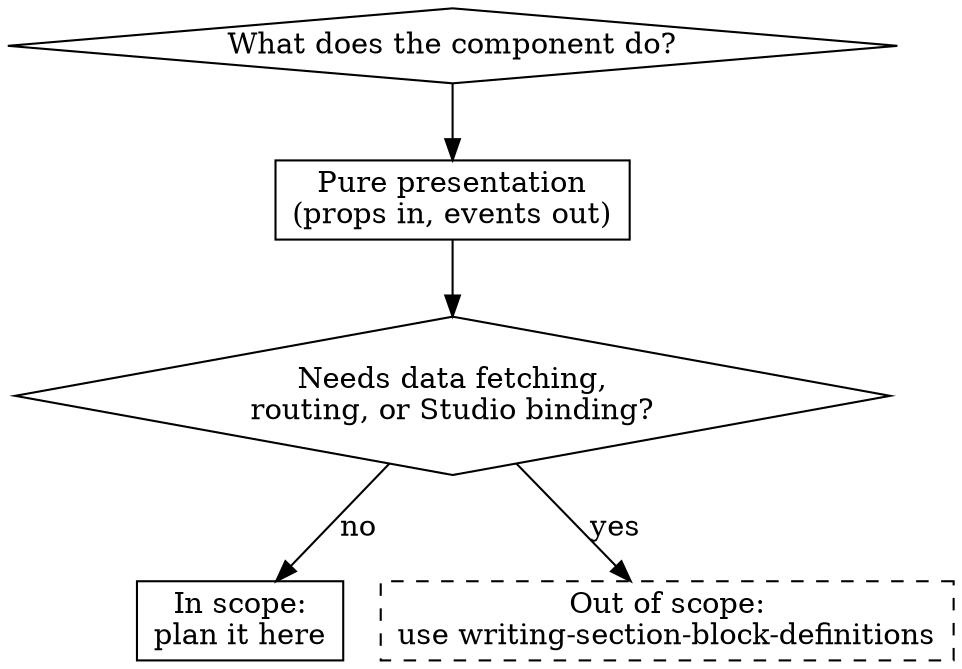

# Component Matching and Placement

Used in Phase 3 of `figma-design-analysis`. Search the existing inventory before planning anything NEW, describe modification intent for REUSE components, surface any cross-file issues you notice, place components in the right scope, decompose complex designs into hierarchies, and use the Early Exit path when nothing new is needed.

## Component Matching

Before planning ANY new component, search the existing inventory.

**Prefer reuse over creating new ones.** Before proposing a NEW component, check whether an upstream component (`@laioutr-core/ui-kit` / `@laioutr-core/ui`) already covers the design — mark as EXISTS if it can be used as-is, REUSE if it needs modification. Note that for upstream components, "modification" means **one of**:

- **prop / minor CSS override** when upstream already exposes the seam you need (preferred — see [`public-css-api.md`](../../laioutr-platform/references/public-css-api.md))
- **local wrapper** in your own module that composes the upstream component (treats the REUSE as a new local component built on top)
- **fork via `laioutr/ui-source`** when the upstream internals need to change — copy the file into your module and modify locally, or open an upstream issue/PR

The plan only needs to describe **what** has to change and **why** — pick the resolution mechanism at implementation time (see [`three-layer-architecture.md`](../../laioutr-platform/references/three-layer-architecture.md) for the ladder). If the design also matches a component you've already authored in your own module (`src/runtime/components/`), mark it the same way.

### Search Process

```bash
# 1. Check @laioutr-core/ui-kit atomic components
ls node_modules/@laioutr-core/ui-kit/src/runtime/app/components/

# 2. Check @laioutr-core/ui commerce organisms
ls node_modules/@laioutr-core/ui/src/runtime/components/
ls node_modules/@laioutr-core/ui/src/runtime/components/organism/

# 3. Search by keyword from the Figma design
grep -r "ComponentNameFromFigma" \
  node_modules/@laioutr-core/ui-kit/src/ \
  node_modules/@laioutr-core/ui/src/
```

(Path layout assumes npm/yarn; pnpm users adjust to `node_modules/.pnpm/...`.)

### Common Matches

| Figma Element | Existing Component | Import Path |
|---|---|---|
| Text / Heading / Body / Caption | CSS classes (deprecated `Text`) | Use `heading-m`, `body-s`, `caption-xs` etc. on semantic HTML elements |
| Button (any variant) | `Button` | `#ui-kit/components/Button/Button.vue` |
| Button adapting to background | `BackgroundAwareButton` | `#ui-kit/components/BackgroundAwareButton/BackgroundAwareButton.vue` |
| Icon | `Icon` | `#ui-kit/components/Icon/Icon.vue` |
| Image / Media | `Media` | `#ui-kit/components/Media/Media.vue` |
| Input / Text Field | `Input` | `#ui-kit/components/Input/Input.vue` |
| Form Field (label + input + error) | `Field` | `#ui-kit/components/Field/Field.vue` |
| Checkbox | `InputCheckbox` | `#ui-kit/components/InputCheckbox/InputCheckbox.vue` |
| Dropdown / Select | `Select` | `#ui-kit/components/Select/Select.vue` |
| Card container | `Card` | `#ui/components/Card/Card.vue` |
| Dialog / Modal | `Dialog` | `#ui-kit/components/Dialog/Dialog.vue` |
| Accordion | `Accordion` + `AccordionItem` | `#ui-kit/components/Accordion/` |
| Star rating display | `StarsRating` | `#ui-kit/components/StarsRating/StarsRating.vue` |
| Color swatch | `ColorSwatch` | `#ui-kit/components/ColorSwatch/ColorSwatch.vue` |
| Product tile | `ProductTileBasic` | `#ui/components/organism/ProductTileBasic/` |
| CTA Banner base | `CtaBannerBase` | `#ui-kit/components/CtaBanner/CtaBannerBase.vue` |
| Product flags (sale/new/promo) | `ProductTileFlag` | `#ui-kit/components/ProductTileFlag/` |
| Progress bar | `ProgressBar` | `#ui-kit/components/ProgressBar/ProgressBar.vue` |
| Loading spinner | `LoadingSpinner` | `#ui-kit/components/LoadingSpinner/` |
| Navigation menu | `NavigationMenu` + subcomponents | `#ui-kit/components/NavigationMenu/` |

**Always compose from existing components. Never recreate primitives.**

### Describing Modification Intent (REUSE Components)

For each existing component that needs modification, describe **what** needs to change and **why** at a high level. Do NOT specify exact props/slots — that's for the `figma-component-architecture` skill.

**Good:** "RadioSelectItem needs to support expandable content when selected and a custom icon area — the checkout shipping selector shows a radio that reveals delivery date options on selection."

**Bad:** "Add an `expandable` prop of type boolean and a `#icon` slot to RadioSelectItem."

### Cross-File Verification

When analyzing an existing component you're considering for REUSE — typically a presentational primitive plus its Section/Block wrapper (e.g., a `defineSection` in your own `src/runtime/app/section/` that wraps an upstream organism, or two local components composed together) — trace props through the chain and surface issues. Where the issues land depends on who owns the file:

- **In components your module owns:** these are actionable — list as concrete fixes in the plan's Issues Found section.
- **In upstream `@laioutr-core/*` components:** these are advisory — note them so the dev can decide whether to file an issue against `laioutr/ui-source` or accept the limitation. They're not blocking work in this plan.

The seven checks:

1. **Check for double processing** -- If a wrapper calls a utility (e.g., `colorValueToCss`) on a value and then the inner component calls it again, flag it. Classify severity: if the function is idempotent on its own output, it's a code smell / confused responsibility rather than a functional bug.
2. **Check for prop/schema mismatches** -- If a presentational component accepts a prop value but the Section/Block schema doesn't expose it as an option, flag the discrepancy.
3. **Check for dead injection keys** -- If `types.ts` defines an `InjectionKey` / `Symbol`, verify that matching `provide()` and `inject()` calls exist in the component tree. Unused injection keys are dead code.
4. **Check for duplicate CVA classes** -- If the same CSS class is added by multiple CVA definitions, flag the redundancy.
5. **Check for overlapping CVA compound variants** -- When multiple compound variants can match simultaneously, trace which utility classes apply and whether they conflict. Dense padding/margin compound variants with breakpoint overrides are especially error-prone.
6. **Check for fragile CSS coupling** -- If CSS selectors reference another component's internal class names (e.g., one component targeting another's BEM internals from outside), flag as fragile coupling.
7. **Check for hardcoded config maps** -- If a component has a hardcoded map keyed by theme ID, verify completeness:

```bash
# List all registered themes (from upstream)
ls node_modules/@laioutr-core/ui-kit/src/runtime/app/theme/

# Compare against hardcoded keys in the component
grep -n "laioutr\|classic\|tech\|sunny\|strawberry" path/to/ComponentName.vue
```

Missing entries in hardcoded maps are silent bugs -- they fall back to defaults without error.

## Scope: presentational components only

**This skill only plans presentational components.** They receive data via props and emit events, with no direct connection to external systems (APIs, Orchestr handlers, Pinia stores, payment SDKs). Data binding and Studio wiring happen in `defineSection` / `defineBlock` wrappers, which are out of scope for this skill — that's the `writing-section-block-definitions` skill's territory.

New components live in your Nuxt module under `src/runtime/components/<Name>/`. There's no "which package" decision to make for new components — the upstream `@laioutr-core/ui-kit` / `@laioutr-core/ui` split only matters when **searching for matches**: ui-kit holds atomic primitives, ui holds commerce organisms.



When recording matches, note where the existing component lives so the implementer can find it:

| Where the existing component lives | Examples | Typical import path |
|---|---|---|
| Upstream `@laioutr-core/ui-kit` (atomic) | Button, Card, Icon, Input, Dialog | `#ui-kit/components/<Name>/<Name>.vue` |
| Upstream `@laioutr-core/ui` (commerce) | ProductTile, Header, Footer, CartSheet | `#ui/components/<Name>/` or `#ui/components/organism/<Name>/` |
| Already in your own module | (whatever you've authored) | `~/components/<Name>/` or your module's alias |

## Decomposing Complex Designs

For multi-component designs (checkout flows, full pages):

1. **Identify visual boundaries** -- Each distinct section with its own background, padding, or card container is a candidate component
2. **Check Figma layer names** -- Designers name layers semantically (e.g., "Order Summary", "Payment Form", "Cart Items")
3. **Map to component hierarchy** -- every component is either composed into another component or will eventually be wrapped by a Section/Block:
   - Atomic elements (buttons, inputs, icons) → usually already in upstream `@laioutr-core/ui-kit`
   - Commerce organisms (product tiles, cart sheets) → usually already in upstream `@laioutr-core/ui`
   - Anything new → your module's `src/runtime/components/<Name>/`
4. **Start from leaves** -- Plan implementation of innermost components first, then compose outward
5. **One component per Figma logical group** -- Don't create a component for every Figma frame; group by semantic meaning

**Every region of the design must be accounted for.** If a designer created a named component, instance, or visually distinct region in the Figma design, it MUST appear in the Component Hierarchy — as NEW, EXISTS, or REUSE. You do not get to decide that something is "too simple to be a component" or "barely warrants its own component." A checkout header with just a logo and a back-link is still a component. A footer with just legal links is still a component. Simplicity is not a reason to omit — it just means the component is easy to implement.

**The only things excluded from the hierarchy are:**
- Pure text content that maps to CSS typography classes (headings, body text, captions)
- Standard HTML elements that don't need a Vue component wrapper (a `<hr>` divider, a plain `<a>` link)
- Layout primitives that are just CSS (a flex container, a grid wrapper) — unless the designer gave them distinct visual treatment (background, border, padding that makes them a "card" or "section")

**Hidden elements:** Include elements marked `hidden="true"` in the hierarchy but annotate them as `[hidden]`. Hidden elements represent alternate states (e.g., an expanded form hidden in the collapsed view) or optional features (e.g., a focus ring). They are important for understanding the full interaction model.

**Layout frames vs semantic components:** When `get_metadata` shows plain `<frame>` nodes (not `<instance>` or `<symbol>`), distinguish between:
- **Semantic frames** that represent a distinct UI concept (e.g., "express checkout method", "account", "shipping") — these need their own Vue component
- **Structural frames** that are just CSS layout containers (e.g., "main", "content", "left", "right", "row 30/70") — these become `<div>` elements with CSS, not Vue components

Mark structural frames as `(layout)` in the hierarchy so the implementation skill knows they are CSS-only. If in doubt, it's a semantic component — err on the side of creating components.

## Early Exit: All Components Already Exist

After decomposing and matching, if the hierarchy contains **zero NEW or REUSE components** (everything is EXISTS or external), the design does not require any new presentational components. Instead of producing an empty plan:

1. **Tell the user:** "All components in this design already exist. No new presentational components are needed."
2. **Present the hierarchy anyway** as a confirmation/audit — it maps Figma regions to existing components, which is still valuable for verification.
3. **Suggest next steps:** The remaining work is likely a Section/Block wrapper that assembles these existing components (see `writing-section-block-definitions`), or page-layout work — both outside this skill's scope.
4. **Skip Phases 4-5** (section-by-section presentation and challenge) — they add no value when there's nothing to plan.

This commonly happens when analyzing page compositions from "component examples" or showcase files where all UI elements are already implemented.

**Do NOT plan page components, page layouts, or Nuxt routing.** Those are Nuxt-layer concerns handled outside this skill's scope. The top-level output of this skill is always a self-contained, composable component (organism) that can be placed anywhere via a Section/Block wrapper.
