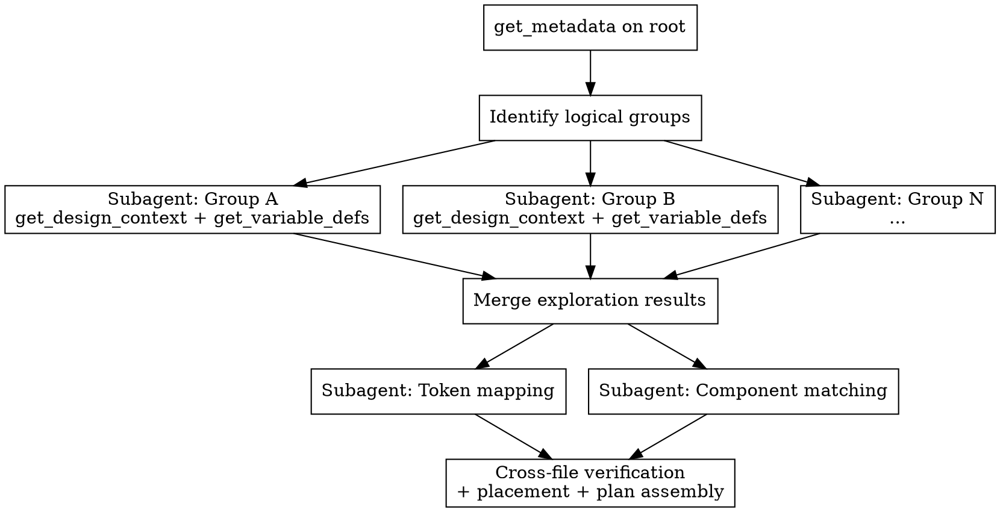

# Subagent Orchestration

For complex multi-component designs, `figma-design-analysis` parallelizes exploration using subagents. This reference describes the pipeline, the per-stage subagent prompts, and the constraints.

## Pipeline

## Pipeline Stages

| Stage | Parallel? | Subagent prompt includes | Returns |
|---|---|---|---|
| Root exploration | No (sequential) | Figma URL, root node ID | Tree structure, group names + node IDs |
| Per-group exploration | **Yes** (1 subagent per group) | Group node ID, `clientLanguages: "typescript,vue"` | Component hierarchy, tokens used, visual structure |
| Token mapping | **Yes** (parallel with matching) | All collected Figma variables from merge | Token mapping table (Figma var → CSS var) |
| Component matching | **Yes** (parallel with tokens) | All component names from merge | Existing matches table, cross-file issues |
| Plan assembly | No (sequential) | All above results | Final plan document |

## Subagent Prompts

**Per-group exploration subagent:**
> Explore Figma node `{nodeId}` using `get_design_context` with `clientLanguages: "typescript,vue"`, `clientFrameworks: "vue,nuxt"`. Also call `get_variable_defs` on the same node. Return: (1) component hierarchy with element names, (2) all Figma variables referenced, (3) variant axes if this is a variant set, (4) **every `data-development-annotations="..."` value found in the response, verbatim, paired with the `data-node-id` and `data-name` of the annotated element** — these are designer-authored notes about behavior, optionality, routing, and package placement. Use the jq scan recipe in [`phase-1-figma-exploration.md`](./phase-1-figma-exploration.md) under "Extracting Dev-Mode Annotations". If no annotations exist, return "no annotations". Use `get_screenshot` if layout isn't clear from context.

**Component matching subagent:**
> Search for existing components matching these names: `{componentNames}`. Search paths: `node_modules/@laioutr-core/ui-kit/src/runtime/app/components/`, `node_modules/@laioutr-core/ui/src/runtime/components/`, `node_modules/@laioutr-core/ui-app/src/runtime/app/section/`. For each match, return: component path, props interface, and import alias. For components with section wrappers, also read the wrapper to check for cross-file issues (double processing, prop mismatches, dead injection keys).

**Token mapping subagent:**
> Map these Figma variables to CSS custom properties using the conversion rules in [`token-mapping.md`](./token-mapping.md): `{variables}`. Validate any hex colors against installed token files: `grep -ri "{hex}" node_modules/@laioutr-core/ui-tokens/src/figma/`. Return the complete mapping table.

## Constraints

- **Figma MCP bottleneck**: All subagents call the same Figma desktop app via MCP. Parallel reads work, but if the app throttles, dispatching 5+ simultaneous `get_design_context` calls may queue. Monitor for timeouts.
- **Merge step is critical**: The orchestrating agent must merge per-group results before dispatching Phase 2 subagents. Don't skip the merge -- token mapping needs the full variable list, component matching needs all component names.
- **Plan assembly stays in the main agent**: Only the orchestrating agent has full context to make placement decisions and assemble the final plan document.
