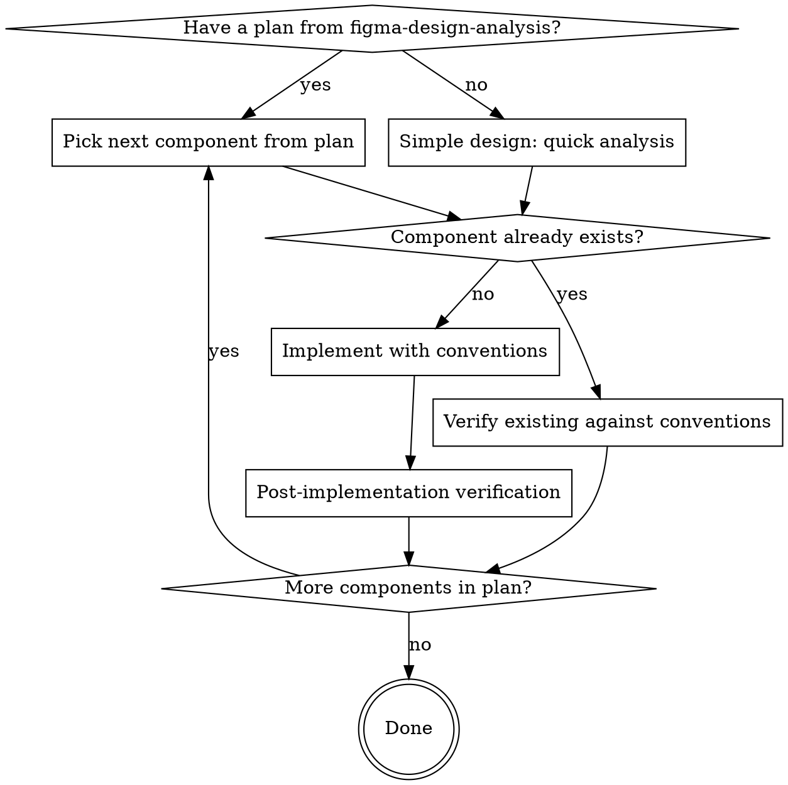

# Figma to Component

## Overview

Implement Vue components for the Laioutr monorepo following project conventions. Works in two modes:
1. **From a plan** -- Receives a plan from `figma-design-analysis` and implements one component at a time
2. **Standalone** -- For simple single-component designs, performs lightweight analysis + implementation in one pass

**REQUIRED SUB-SKILL for complex designs:** Use `figma-design-analysis` first to produce a plan.

## When to Use

- Implementing a component from a `figma-design-analysis` plan
- Implementing a simple single-component Figma design (banner, card, hero)
- Verifying an existing component against project conventions

## Process Flowchart



## Quick Analysis (standalone mode only)

For simple single-component designs, perform lightweight analysis before implementing:

1. `get_design_context` with `clientLanguages: "typescript,vue"` and `clientFrameworks: "vue,nuxt"`
2. `get_variable_defs` for token definitions
3. Extract variant matrix (each Figma axis -> prop, breakpoints -> CSS media queries)
4. Search for existing components: `grep -r "ComponentName" packages/ui-kit/src/ packages/ui/src/ packages/ui-app/src/`
5. Decide package placement (see placement decision tree below)

**If the design has 3+ visual groups, STOP and use `figma-design-analysis` instead.**

**If Figma MCP tools fail** (e.g., desktop app not open), ask the user to open the file in Figma desktop. Do not proceed to implementation without Figma data.

### Existing Component Found?

If step 4 reveals the component already exists, switch to **verification mode** instead of implementation:
1. Read all existing component files (`.vue`, `types.ts`, `.stories.ts`)
2. Run the Post-Implementation Verification checklist against the existing code
3. Report issues found -- do NOT rewrite the component unless explicitly asked

### Token Conversion Quick Reference

| Figma Pattern | CSS Pattern | Rule |
|---|---|---|
| `Spacing/2XL` | `var(--spacing-2-xl)` | `/` -> `-`, numbers get `-` separator |
| `colors/primary/9` | `var(--primary-9)` | `colors/` prefix dropped |
| `buttons/primary/default/bg-color` | `var(--buttons-primary-default-bg-color)` | Direct `/` -> `-` |
| `greys/stone_grey/5` | `var(--stone-grey-5)` | `greys/` dropped, `_` -> `-` |

Full conversion rules are in the `figma-design-analysis` skill.

### Package Placement

| Package | Component Type | Examples | Directory |
|---|---|---|---|
| `ui-kit` | Atomic, reusable across contexts | Button, Card, Icon, Input, Dialog | `src/runtime/app/components/` |
| `ui` component | Mid-level commerce compositions | DarkModeSwitch, RatingInput, SwatchItem | `src/runtime/components/<Name>/` |
| `ui` organism | Complex page sections | Header, Footer, CartSheet, ProductGrid | `src/runtime/components/organism/<Name>/` |
| `ui` legacy section | `defineSection()` page sections (global, no prefix) | CmsContainer, BrandHero | `src/runtime/components/<Name>/` |

## Implementation Conventions

### Component File Structure

```
ComponentName/
├── ComponentName.vue          # Main component
├── SubComponent.vue           # If compound (optional)
├── ComponentContext.ts         # If compound: createContext for parent-child state (optional)
├── types.ts                   # If types > 50 lines (optional)
└── ComponentName.stories.ts   # Storybook stories (required)
```

### Script Pattern

```vue
<script lang="ts">
// Type exports in non-setup block (importable by consumers)
export interface ComponentProps {
  variant?: 'primary' | 'secondary';
  size?: 's' | 'm' | 'l';
}
</script>

<script setup lang="ts">
import Button from '#ui-kit/components/Button/Button.vue';

const props = withDefaults(defineProps<ComponentProps>(), {
  variant: 'primary',
  size: 'm',
});

// Two-way binding (Vue 3.4+): use defineModel for v-model props
const isOpen = defineModel<boolean>('isOpen');

defineSlots<{
  default(): any;
  // Scoped slot example:
  // items(props: { item: T }): any;
}>();
</script>
```

**When to use `types.ts` vs inline:** Use the non-setup `<script lang="ts">` block for prop interfaces (always). Only extract to `types.ts` when types are shared across multiple sub-components or exceed 50 lines. Never export types from `<script setup>` -- they are not importable by consumers.

### Compiler Macros Reference

| Macro | Purpose | Example |
|---|---|---|
| `defineProps<T>()` | Typed props declaration | `defineProps<ComponentProps>()` |
| `withDefaults()` | Default values for typed props | `withDefaults(defineProps<T>(), { size: 'm' })` |
| `defineEmits` | Typed event declarations (use Vue 3.3+ tuple syntax) | `defineEmits<{ click: [e: MouseEvent]; change: [value: string] }>()` |
| `defineModel` | Two-way `v-model` binding (Vue 3.4+) | `const isOpen = defineModel<boolean>('isOpen')` |
| `defineSlots` | Typed slot declarations | `defineSlots<{ default(): any; items(props: { item: T }): any }>()` |
| `defineOptions` | Component options in `<script setup>` | `defineOptions({ inheritAttrs: false })` |
| `defineExpose` | Expose properties/methods to parent via template refs | `defineExpose({ focus: () => input.value?.focus() })` |
| `useTemplateRef` | Type-safe template refs (Vue 3.5+) | `const el = useTemplateRef<HTMLInputElement>('input')` |

**`defineEmits` syntax:** Always use the Vue 3.3+ tuple syntax. The older call-signature syntax (`(e: 'click'): void`) is legacy and should not be used in new components.

### Common Import Paths

| Import | Source |
|---|---|
| Component `.vue` files | `#ui-kit/components/ComponentName/ComponentName.vue` |
| Type exports (e.g., `IconName`) | `#ui-kit/types` |
| NuxtLink (for runtime `:is` refs) | `import { NuxtLink } from '#components'` |
| Story helpers (MediaImage factory) | `import { toMedia } from '#ui-kit/imports/toMedia'` |
| Composables, Vue APIs | `#imports` |

**Prefer explicit imports** over Nuxt auto-imports, even when auto-registration is available (e.g., `Lui`-prefixed components). Explicit imports make dependencies visible and traceable. The project is transitioning toward auto-imports with the `L` prefix; during this transition, use explicit imports for new components. When verifying existing code, either pattern is acceptable.

### CSS Pattern

- **Unscoped CSS** (no `scoped` attribute)
- **BEM naming**: `.component-name`, `.component-name__element`, `.component-name--modifier`
- **All values from tokens**: `var(--spacing-m)`, `var(--text-primary)`, never hardcoded colors/sizes. **Exception**: `1px`/`2px` for borders and outlines are acceptable; semantic sizes (min-height, padding, gap, font-size) must always use tokens.
- **Responsive**: Use `@media (--lg)` syntax (custom PostCSS breakpoints). Exception: `@container` queries are valid when the parent component sets `container-type: inline-size` (e.g., `CtaBannerBase`). Never use `@container` with hardcoded pixel values as a substitute for media queries.
- **States**: `:hover`, `:active`, `:focus-visible`, `:disabled`, `[data-state="open"]`
- **Reka UI data attributes**: When composing with reka-ui primitives, style states via data attributes that reka emits on its root elements (e.g., `[data-state="open"]`, `[data-state="closed"]`, `[data-highlighted]`, `[data-disabled]`, `[data-orientation]`). Don't add parallel boolean classes — let the data attributes drive the styling so reka's keyboard/aria behavior stays the source of truth. Check the [reka-ui docs](https://reka-ui.com/) for the exact attributes each primitive emits.
- **Accessibility**: Interactive components must support keyboard navigation, visible focus states (`outline: 2px solid var(--buttons-focus-ring)`), and ARIA attributes. Use reka-ui primitives for complex patterns (accordion, dialog, dropdown).
- **Layout model awareness**: When verifying layout wrapper components, trace how `container-type`, `overflow`, and bleed patterns interact. A parent with `container-type: inline-size` enables `cqw`/`@container` in descendants. `overflow: hidden` on a wrapper may be required for Swiper containment but can clip bleed elements. Document these dependencies when found.

### Breakpoint Syntax

```css
/* Mobile-first base */
.component { padding: var(--spacing-s); }

/* Tablet+ */
@media (--sm) { .component { padding: var(--spacing-m); } }

/* Desktop+ */
@media (--lg) { .component { padding: var(--spacing-l); } }

/* Available: (--xs) 360px, (--s) 414px, (--sm) 600px, (--md) 800px, (--lg) 1280px, (--xl) 1920px */
```

### Container Query Units & Bleed

The root element `#__nuxt` has `container-type: inline-size` (set in `global.css`), making `cqw` units available globally as a viewport-width-without-scrollbar equivalent. This is used for "break out of container" patterns.

**Bleed utilities** (defined in `bleed.css`):

```css
:root { --bleed-width: calc(50cqw - var(--container-inner-width) / 2); }
.bleed-full  { margin-left: calc(50% - 50cqw); margin-right: calc(50% - 50cqw); }
.bleed-left  { margin-left: calc(50% - 50cqw); }
.bleed-right { margin-right: calc(50% - 50cqw); }
```

**Usage in components:** Apply `calc(50% - 50cqw)` margins to break an element out of its container to full viewport width. Use `--bleed-width` for asymmetric bleeds or padding calculations.

When verifying, do NOT flag `cqw` units as non-standard -- they are an established pattern in this codebase.

### UnoCSS Responsive Utility Classes

Some existing components use UnoCSS utility classes for responsive text sizing. These are **not** hardcoded values -- they are valid breakpoint-aware utilities defined in the UnoCSS config. Note: the project uses a Tailwind-compatible UnoCSS preset; only utilities from this preset are available (the default UnoCSS `components` and `uno` presets are disabled).

```
Pattern: {breakpoint}:{utility}
Example: s:text-xl  →  applies text-xl at the (--s) breakpoint (414px+)
```

When verifying existing components, do NOT flag UnoCSS responsive classes (e.g., `s:text-xl`, `sm:text-m`) as convention violations. They serve the same purpose as `@media (--s)` but via utility classes.

### Responsive Rendering

**Prefer a single DOM tree with CSS breakpoints.** Avoid rendering entirely different DOM trees per breakpoint (e.g., `hidden sm:flex` / `block sm:hidden`). Duplicate DOM increases bundle size, complicates state management, and doubles the surface area for bugs.

If a design cannot be implemented purely through CSS breakpoints and requires a JavaScript breakpoint listener, evaluate alternatives before proceeding:
1. Use a single DOM tree and show/hide elements based on the breakpoint via CSS
2. Ask the developer to review the design and suggest alternative approaches

### Text Styling (CSS classes, NOT Text component)

The `Text` component is **deprecated**. Use CSS classes instead:

```
Pattern: {type}-{size}
Types:   body | heading | subline | caption
Sizes:   xs | s | sm | m | ml | l | xl | 2xl | 3xl | 4xl
```

| Figma font-size token | CSS class | Example |
|---|---|---|
| `font size/XS` (12px) | `subline-xs` or `caption-xs` | `<span class="subline-xs">` |
| `font size/S` (14px) | `body-s` or `heading-xs` | `<p class="body-s">` |
| `font size/SM` (14px) | `body-sm` | `<p class="body-sm">` |
| `font size/M` (18px) | `heading-s` or `body-m` | `<h3 class="heading-s">` |
| `font size/ML` (23px) | `heading-m` | `<h2 class="heading-m">` |
| `font size/L` (28px) | `heading-l` | `<h2 class="heading-l">` |
| `font size/XL` (35px) | `heading-xl` | `<h1 class="heading-xl">` |

**Match the Figma text style name (heading, body, subline, caption) to the class prefix. Use semantic HTML elements (`h1`-`h6`, `p`, `span`) with the appropriate class.**

### Third-Party Component Integration (Swiper, etc.)

When the design contains carousels/sliders, use the existing `CommonSwiper` wrapper rather than raw Swiper:

```vue
<script setup lang="ts">
import CommonSwiper from '#ui-kit/components/CommonSwiper/CommonSwiper';
import { SwiperAutoplay, SwiperEffectCreative, SwiperNavigation, SwiperPagination } from '#imports';

const swiperOptions = {
  slidesPerView: 1,
  loop: true,
  speed: 1000,
  effect: 'creative',
  modules: [SwiperNavigation, SwiperPagination, SwiperAutoplay, SwiperEffectCreative],
};
</script>

<template>
  <CommonSwiper v-bind="swiperOptions" @swiper="handleSwiper" @slide-change="handleSlideChange">
    <slot />
    <template #container-end>
      <!-- Navigation/pagination slots go here -->
    </template>
  </CommonSwiper>
</template>
```

**Key points:** Import Swiper modules from `#imports`, not from `swiper/modules`. Use `CommonSwiper` (render function wrapper in `#ui-kit/components/CommonSwiper/CommonSwiper`), not raw `<Swiper>`. Navigation and pagination elements go in the `#container-end` slot.

### createContext for Compound Components

For parent-child state sharing (e.g., slider providing context to slides), use `createContext` from `reka-ui`:

```typescript
// SliderContext.ts
import { createContext } from 'reka-ui';
import type { ComputedRef } from 'vue';

export const [injectSliderContext, provideSliderContext] = createContext<{
  isSingleSlide: ComputedRef<boolean>;
}>('SliderContext');
```

Parent calls `provideSliderContext({ isSingleSlide })`, children call `injectSliderContext()`. `createContext` returns a tuple `[injectFn, provideFn]` — the naming convention is `inject*Context` / `provide*Context`.

### LCP Optimization for Hero Components

Hero/above-the-fold components should use `MediaAboveTheFoldProvider` to signal eager loading for LCP images:

```vue
<MediaAboveTheFoldProvider :value="toRef(isAboveTheFold)">
  <Media :media="backgroundImage" sizes="100vw" />
</MediaAboveTheFoldProvider>
```

Import from `#ui-kit/components/Media/MediaAboveTheFoldProvider`. The provider sets eager loading for images within its scope when `isAboveTheFold` is true.

### Background Brightness

Use `OnBackground` to wrap content that adapts to background brightness (dark/light/bright). It provides `Ref<BackgroundBrightness>` via `createContext` and sets CSS variables (`--font-color`, `--font-color-subline`, `--font-color-caption`, `--font-color-body-text`, `--icon-color`) so text/icons auto-switch between white and black.

```vue
<OnBackground :brightness="backgroundBrightness" class="hero-slide">
  <!-- Content inside automatically gets appropriate text colors -->
</OnBackground>
```

**Values:** `'dark'` (white text), `'light'` (default/themed), `'bright'` (black text). Supports auto-detection from hex colors via WCAG contrast formula.

**Child access:** Use `useBackgroundBrightness()` composable to read the current brightness in descendant components (defaults to `'light'` outside any `OnBackground` scope).

### Section Component Pattern (for defineSection)

```vue
<script lang="ts">
const definition = defineSection({
  component: 'SectionComponentName',
  studio: { label: 'Human-Readable Name' },
  schema: [
    {
      label: 'Content',
      fields: [
        { label: 'Headline', name: 'headline', type: 'text' },
        // ... field definitions
      ],
    },
  ],
});
</script>

<script setup lang="ts">
import { defineSection, definitionToProps } from '#imports';
const props = defineProps(definitionToProps(definition));
</script>
```

**Never export `definition` from `defineSection` or `defineBlock`.** These definitions are internal to the SFC and should not be consumed by other components.

### Story Helpers

- **`toMedia(url, width, height)`** -- Creates a `MediaImage` object for stories. Import from `#ui-kit/imports/toMedia`.
- **Compound component stories** -- For components with slots (e.g., Footer with FooterMenu children), use a custom `render` function that maps `args.slots.default` to child components via `v-for`.

## Post-Implementation Verification

Run both passes in order. The convention pass is fast and mechanical (grep + visual scan). The logic pass requires reading and tracing code flow — only run it for components with non-trivial `<script setup>` logic (computed properties, watchers, async operations, state flags). Skip the logic pass for pure prop-to-template components.

### Convention Pass

1. **Type export pattern** -- Props interface must be in a separate `<script lang="ts">` block (not in `<script setup>`), so consumers can import the type
2. **No hardcoded pixel values** -- Semantic sizes (padding, gap, min-height, font-size) must use CSS custom properties. `1px`/`2px` for borders and outlines are acceptable. Grep for bare `px` values: `grep -n '[0-9]px' ComponentName.vue` and triage each hit.
3. **`justify-content: end`** not `flex-end` -- Use logical values (`start`/`end`) which respect writing direction (LTR/RTL). Use `flex-start`/`flex-end` only when you explicitly need physical axis alignment regardless of text direction
4. **No raw asset paths in components** -- Theme-specific images should be registered in the theme system and accessed via `useTheme()`, not hardcoded as string literals
5. **BEM naming consistency** -- Class names should follow `.block__element--modifier`. Flag names that embed state into the element name (e.g., `__img-cs-boxed-bg-none` should be `__img--boxed-no-bg` or use separate modifier classes). Abbreviations in class names (e.g., `cs` for `containerStyle`) reduce readability.
6. **CVA type safety** -- Flag `as Record<string, string>` or `as any` type assertions in CVA variant definitions. These suppress TypeScript's ability to validate variant values, allowing invalid prop values to pass silently.
7. **Story coverage vs variant matrix** -- Compare the variant axis count against actual Storybook story count. Flag major gaps, especially for multi-axis combinations (e.g., no story for `proportions: '70/30'` + `background: 'solid'` + `containerStyle: 'boxed'`).
8. **`defineSlots` typing** -- Components using `<slot />` should type their slots via `defineSlots<{ default(): any }>()` for better consumer DX
9. **Experimental CSS properties** -- Flag any CSS properties with limited browser support (e.g., `grid-template-rows: masonry`). If the design can only be implemented with experimental CSS, ask the developer to review the usage and suggest alternative approaches.
10. **Cross-component CSS coupling** -- Grep for selectors that target another component's internal BEM classes (e.g., `.footer-section .accordion--buttons`). List all such selectors and flag them as coupling points. **Preferred fix:** Evaluate whether the child component can be extended (new prop, modifier class, or CSS custom property) to support the needed variation -- this is more maintainable than overriding from outside. If overrides are unavoidable, document the dependency with a `/* couples to: ComponentName */` comment.
11. **Calibrate against codebase reality** -- Before flagging a pattern as a violation, grep for precedent in the codebase. If the pattern is widespread (5+ occurrences), downgrade from "violation" to "note: inconsistent with convention but established in codebase." Distinguish between **proposed new conventions** (aspirational, not yet adopted) and **violations of existing conventions** (clearly deviates from established patterns).
12. **i18n completeness** -- Grep for all user-facing text: plain text nodes between tags, `:aria-label`, `:title`, `:placeholder`, and string literals in template attributes. Every user-facing string should use `t('key')` via the locale composable, not hardcoded text. Check both **visible text content** (e.g., `<Text>close</Text>`) AND **accessibility attributes** (e.g., `:aria-label="'key'"`). A common miss: catching ARIA labels but ignoring adjacent visible text in the same template region.
13. **CSS property redundancy** -- Within each CSS rule block, check for duplicate property declarations where the latter overrides the former (e.g., `align-items: center;` followed by `align-items: flex-start;` in the same rule). This is either dead code or a merge artifact. Also check for orphaned selectors whose class name doesn't match any element in the template (e.g., `.zoom-level-selector-wrapper` when the template uses `.component__zoom-level-selector-wrapper`).
14. **SSR safety: no bare browser API access** -- Grep for `window`, `document`, `navigator`, `localStorage`, `sessionStorage` in `<script setup>` outside of `onMounted`/`process.client`/`import.meta.client` guards. These crash during server-side rendering. Browser-only APIs (`IntersectionObserver`, `ResizeObserver`, `matchMedia`, `MutationObserver`) must also be wrapped in `onMounted`.
15. **`defineEmits` syntax** -- Flag the legacy call-signature syntax (`defineEmits<{ (e: 'click'): void }>()`) and recommend the Vue 3.3+ tuple syntax (`defineEmits<{ click: [e: MouseEvent] }>()`).
16. **`!important` declarations** -- Flag any `!important` in CSS. It indicates a specificity conflict that should be resolved structurally (e.g., by adjusting selector specificity, adding a BEM modifier, or using a CSS custom property on the parent). The only acceptable use is overriding third-party styles that cannot be changed.

### Logic Pass

**When to run:** If `<script setup>` contains any `computed()`, `watch()`/`watchEffect()`, `async` function, `ref()` used as a state flag, or non-trivial event handlers. Skip for components that are pure prop-to-template binding.

**Inventory reactive state.** List every `ref()` and `reactive()` in the component. For each:
- Where is it **written** (assigned)? Trace every `.value =` or state mutation.
- Where is it **read** (consumed)? In template, computed, watcher, or passed to child.
- Can it reach an **inconsistent state**? (e.g., set to `true` but never reset to `false`)

**Trace computed edge cases.** For each `computed()`:
- List its reactive inputs (refs, props).
- Check **division**: can the denominator be `0` or `undefined`? Trace through prop defaults and optional props.
- Check **property access**: can any input be `undefined`/`null`, causing `TypeError: Cannot read property 'x' of undefined`?
- Check **array operations**: `.length`, `.map()`, `.filter()` on a prop that could be `undefined`.

**Verify async lifecycle.** For each `async` function or Promise chain:
- Is there **error handling** (`try/catch`, `.catch()`)? Unhandled rejections crash silently.
- Are **loading/state flags** reset in `finally` or on every exit path (success, error, early return)?
- Can the **component unmount** before the async operation completes? If so, guard state updates.

**Trace emit → parent handler → prop flow.** For each `emit()`:
- Does the parent handle it? If the parent mutates state that flows back as a prop, verify no infinite loop (emit → handler → prop change → watcher → emit).
- For `update:modelValue` patterns, verify the parent and child agree on the value type.

**Check default prop propagation.** For every prop with a default (`withDefaults`), trace the default value through:
- Template expressions (ternaries, string interpolation)
- Computed properties (arithmetic, property access)
- Values passed to child components via `v-bind` — the child may not expect the parent's default

### Figma Design Comparison (verification mode only)

When verifying an existing component AND Figma data is available from `get_design_context`/`get_variable_defs`:

1. **Token alignment** -- For each CSS custom property used in the component, verify it corresponds to a Figma variable from `get_variable_defs`. Flag mismatches where the component uses a token that doesn't map to any Figma variable in the design.
2. **Layout structure** -- Compare the component's DOM nesting against the Figma layer hierarchy. Flag significant structural divergences (e.g., Figma has a wrapper group that the implementation flattens, or vice versa).
3. **Responsive breakpoints** -- If the Figma design has variant axes for viewport size, verify the component's `@media` breakpoints cover the same set.
4. **Visual state coverage** -- If the Figma design has state variants (hover, active, disabled, zoomed), verify each has a corresponding CSS rule or class toggle.

If Figma data is unavailable (tool failure, no URL provided), skip this section and note it was skipped.

## Common Mistakes

| Mistake | Fix |
|---|---|
| Using `<Text>` component for text styling | Text is deprecated. Use CSS classes: `heading-m`, `body-s`, `caption-xs`, etc. |
| Hardcoding colors from Figma hex values | Look up the hex in token files, use `var(--token-name)` |
| Creating a new Button/Input/Card component | Search ui-kit first -- it almost certainly exists |
| Using `scoped` CSS | Remove `scoped`, use BEM prefixes for isolation |
| Using `@container` as a substitute for media queries | Use `@media (--lg)` for responsive layouts. `@container` is only valid when the parent sets `container-type: inline-size` |
| One component per Figma variant | One component with props -- variants are CSS modifiers |
| Importing with `@laioutr-core/ui-kit/...` | Use `#ui-kit/components/...` alias |
| Processing a value in both wrapper and inner component | Convert once -- either in the section wrapper OR the presentation component, not both |
| Hardcoding theme image paths as string literals | Register images in theme definitions, access via `useTheme()` |
| Hardcoded pixel values for sizes | Use spacing/sizing tokens; grep for bare `px` values before finishing |
| Default prop value producing invalid output (e.g., `undefinedpx`, `NaN`, `Infinity`) | Trace every prop default through template expressions, computed properties, and child component props; use `null` checks not sentinel values |
| CSS selectors targeting another component's internal classes | Prefer extending the child component (new prop/modifier/CSS custom property) over overriding from outside. If unavoidable, add a `/* couples to: ComponentName */` comment |
| Flagging `cqw` units as non-standard | `cqw` is an established pattern -- `#__nuxt` has `container-type: inline-size`. See bleed.css for utility classes |
| Flagging widespread patterns as violations without checking precedent | Grep for precedent first. If 5+ occurrences exist, downgrade to "note" not "violation" |
| `as Record<string, string>` in CVA variant definitions | Use proper union types; type casts suppress validation of variant values |
| BEM names embedding multiple states (`__img-cs-boxed-bg-none`) | Use separate modifier classes or proper BEM modifiers (`__img--boxed`, `__img--no-bg`) |
| Dead injection keys in types.ts | Verify `provide()`/`inject()` calls exist; remove unused symbols |
| Sparse story coverage for multi-axis variant matrix | Cover key axis combinations, especially edge cases like 70/30 + solid + boxed |
| Exporting types from `<script setup>` | Types in `<script setup>` cannot be imported by consumers. Move to non-setup `<script lang="ts">` block |
| Not using reka-ui primitives for complex interactions | Use AccordionRoot, DialogRoot, etc. for keyboard nav, ARIA, focus management |
| Flagging UnoCSS responsive classes as hardcoded values | `s:text-xl`, `sm:text-m` are valid breakpoint utilities, not violations |
| Using raw `<Swiper>` instead of `CommonSwiper` | Use the `CommonSwiper` wrapper from `#ui-kit/components/CommonSwiper/CommonSwiper` |
| Using raw `provide`/`inject` for compound component state | Use `createContext` from `reka-ui` — returns `[injectFn, provideFn]` tuple, not an object |
| Missing `MediaAboveTheFoldProvider` on hero/ATF components | Wrap hero images in `MediaAboveTheFoldProvider` for eager LCP loading |
| Adding BEM classes to elements with no CSS rules | BEM classes should serve CSS or JS targeting, not act as decorative naming. Don't add `.block__element` if no rule references it |
| Using experimental CSS without fallback or review | `grid-template-rows: masonry`, `@property`, etc. have limited support. Ask the developer to review and suggest alternatives |
| Rendering different DOM trees per breakpoint | Prefer a single DOM tree with CSS breakpoints. If the design requires JS breakpoint listeners, ask the developer for guidance |
| Hardcoded user-facing text (e.g., `<Text>close</Text>`) | Use `t('component.key')` via locale composable for all visible text and ARIA labels. Check both text nodes AND attributes |
| Duplicate CSS property declarations in same rule block | The first declaration is dead code if the second overrides it. Remove the redundant one or verify it's a deliberate fallback |
| Skipping Figma design comparison in verification mode | When Figma data is available, compare tokens, layout structure, breakpoints, and visual states against the design -- don't just run the code checklist |
| Accessing `window`/`document`/`navigator` outside `onMounted` or client guards | Wrap browser API access in `onMounted`, `process.client`, or `import.meta.client` -- bare access crashes during SSR |
| Using legacy `defineEmits` call-signature syntax | Use Vue 3.3+ tuple syntax: `defineEmits<{ click: [e: MouseEvent] }>()` not `defineEmits<{ (e: 'click'): void }>()` |
| Using `ref<HTMLElement>(null)` for template refs | Use `useTemplateRef<HTMLElement>('refName')` (Vue 3.5+) for type-safe template refs |
| Exporting `definition` from `defineSection`/`defineBlock` | Section and block definitions are SFC-internal. Never export them -- they should not be consumed by other components |
| Using `!important` to fix styling conflicts | Resolve structurally via BEM modifier, adjusted specificity, or CSS custom property. `!important` is only acceptable for third-party overrides |
| Setting `isLoading = true` without resetting on all paths | Every early return, error catch, and success path must reset the flag. Missing resets permanently lock the UI |
| Dividing by a prop that can be zero or undefined | Guard with `b === 0 ? 0 : a / b` or validate before computing. Check prop defaults — `amount: 0` is a common offender |

## Related skills

- `figma-export-assets` — run **before** wiring up `` / `<Media>` references if the component needs a new raster/SVG file (illustration, partner logo, custom marker, CTA background). Owns the format/scale/destination/filename decisions and the export spec.
- `figma-design-analysis` — upstream of this skill: produces the component hierarchy, token map, and placement plan that this skill implements.
- `component-architecture` — bridges between the two when a plan needs an explicit props/slots/events spec before implementation starts.
